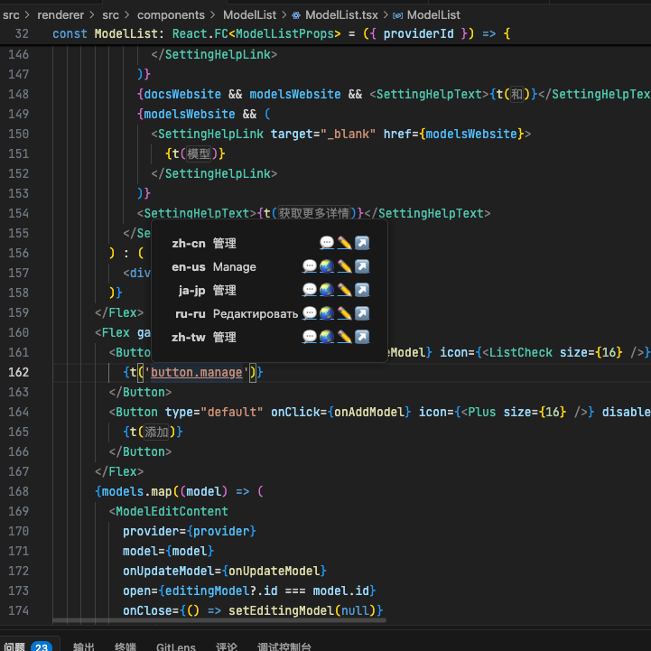
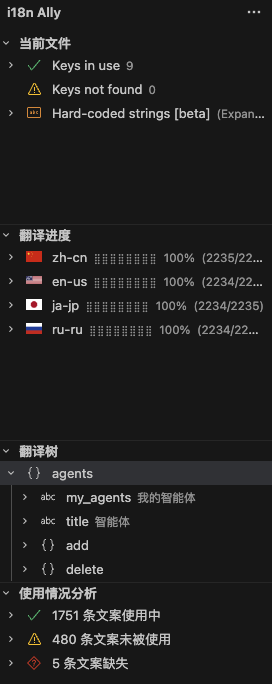
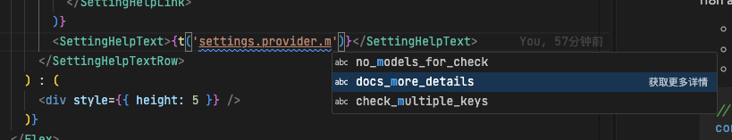

# How to Do i18n Gracefully

> [!WARNING]
> This document is machine translated from Chinese. While we strive for accuracy, there may be some imperfections in the translation.

## Enhance Development Experience with the i18n Ally Plugin

i18n Ally is a powerful VSCode extension that provides real-time feedback during development, helping developers detect missing or incorrect translations earlier.

The plugin has already been configured in the project — simply install it to get started.

### Advantages During Development

- **Real-time Preview**: Translated texts are displayed directly in the editor.
- **Error Detection**: Automatically tracks and highlights missing translations or unused keys.
- **Quick Navigation**: Jump to key definitions with Ctrl/Cmd + click.
- **Auto-completion**: Provides suggestions when typing i18n keys.

### Demo







## i18n Conventions

### **Avoid Flat Structure at All Costs**

Never use flat structures like `"add.button.tip": "Add"`. Instead, adopt a clear nested structure:

```json
// Wrong - Flat structure
{
  "add.button.tip": "Add",
  "delete.button.tip": "Delete"
}

// Correct - Nested structure
{
  "add": {
    "button": {
      "tip": "Add"
    }
  },
  "delete": {
    "button": {
      "tip": "Delete"
    }
  }
}
```

#### Why Use Nested Structure?

1. **Natural Grouping**: Related texts are logically grouped by their context through object nesting.
2. **Plugin Requirement**: Tools like i18n Ally require either flat or nested format to properly analyze translation files.

### **Avoid Template Strings in `t()`**

**We strongly advise against using template strings for dynamic interpolation.** While convenient in general JavaScript development, they cause several issues in i18n scenarios.

#### 1. **Plugin Cannot Track Dynamic Keys**

Tools like i18n Ally cannot parse dynamic content within template strings, resulting in:

- No real-time preview
- No detection of missing translations
- No navigation to key definitions

```javascript
// Not recommended - Plugin cannot resolve
const message = t(`fruits.${fruit}`);
```

#### 2. **No Real-time Rendering in Editor**

Template strings appear as raw code instead of the final translated text in IDEs, degrading the development experience.

#### 3. **Harder to Maintain**

Since the plugin cannot track such usages, developers must manually verify the existence of corresponding keys in language files.

### Recommended Approach

To avoid missing keys, all dynamically translated texts should first maintain a `FooKeyMap`, then retrieve the translation text through a function.

For example:

```ts
// src/renderer/i18n/label.ts
const themeModeKeyMap = {
  dark: "settings.theme.dark",
  light: "settings.theme.light",
  system: "settings.theme.system",
} as const;

export const getThemeModeLabel = (key: string): string => {
  return themeModeKeyMap[key] ? t(themeModeKeyMap[key]) : key;
};
```

By avoiding template strings, you gain better developer experience, more reliable translation checks, and a more maintainable codebase.

## Automation Scripts

The project includes several scripts to automate i18n-related tasks:

### `i18n:check` - Validate i18n Structure

This script checks:

- Whether all language files use nested structure
- For missing or unused keys
- Whether keys are properly sorted

```bash
pnpm i18n:check
```

### `i18n:sync` - Synchronize JSON Structure and Sort Order

This script uses `zh-cn.json` as the source of truth to sync structure across all language files, including:

1. Adding missing keys, with placeholder `[to be translated]`
2. Removing obsolete keys
3. Sorting keys automatically

```bash
pnpm i18n:sync
```

### `i18n:unused` - Find Unused Keys

This script scans the codebase for i18n key references and reports keys that are present in `zh-cn.json` but not found in source code.

This command only prints a report and does not modify any files:

```bash
pnpm i18n:unused
```

The report includes:

- Total unused key count
- Unused key count by top-level namespace
- A few example keys from each namespace

For machine-readable output, use JSON mode:

```bash
pnpm i18n:unused --json
```

#### Cleaning Unused Keys

Use `i18n:remove-unused` when you want to delete unused keys. Cleaning is opt-in and only runs through this remove command.

Run interactive cleanup:

```bash
pnpm i18n:remove-unused
```

The prompt lists top-level namespaces, such as `common`, `settings`, or `translate`. Select one or more namespaces to delete only the unused leaf keys in those groups.

Run non-interactive cleanup for specific namespaces:

```bash
pnpm i18n:remove-unused --groups common,settings
```

Run non-interactive cleanup for all unused keys:

```bash
pnpm i18n:remove-unused --all
```

Cleanup updates both directories:

- `src/renderer/i18n/locales/*.json`
- `src/renderer/i18n/translate/*.json`

After deletion, the script prunes empty objects and sorts keys to keep the files consistent with the existing i18n format.

#### What Counts as Used

The scanner recognizes common static i18n patterns:

- `t("key")` and `i18n.t("key")`
- `<Trans i18nKey="key" />`
- Key fields such as `titleKey`, `labelKey`, `descriptionKey`, `messageKey`, and `i18nKey`
- Known label maps in `src/renderer/i18n/label.ts`
- Comment references like `t("key")`, which keeps i18n Ally-style explicit references valid
- Shortcut labels derived from `SHORTCUT_DEFINITIONS`
- Conditional translation calls such as `t(condition ? "a.key" : "b.key")`
- Static template-expression namespaces when they can be conservatively matched
- Exact full-key text matches anywhere in scanned source files

The exact text match is intentionally conservative: if a complete key string appears in source code, the key is treated as used. This may keep a few truly unused keys, but it avoids deleting keys that are referenced through helper maps, indirect calls, or dynamic code paths.

#### Safe Cleanup Workflow

1. Run `pnpm i18n:unused` and review the grouped report.
2. If a key looks suspicious, search for the exact key in source code before cleaning.
3. Clean only a small namespace at a time with `pnpm i18n:remove-unused --groups <namespace>`, or use `pnpm i18n:remove-unused --all` when the full report has already been reviewed.
4. Review the JSON diff.
5. Run `pnpm i18n:check` after cleanup.

### `i18n:translate` - Automatically Translate Pending Texts

This script fills in texts marked as `[to be translated]` using machine translation.

Typically, after adding new texts in `zh-cn.json`, run `i18n:sync`, then `i18n:translate` to complete translations.

Before using this script, set the required environment variables:

```bash
API_KEY="sk-xxx"
BASE_URL="https://dashscope.aliyuncs.com/compatible-mode/v1/"
MODEL="qwen-plus-latest"
```

Alternatively, add these variables directly to your `.env` file.

```bash
pnpm i18n:translate
```

### Workflow

1. During development, first add the required text in `zh-cn.json`
2. Confirm it displays correctly in the Chinese environment
3. Run `pnpm i18n:sync` to propagate the keys to other language files
4. Run `pnpm i18n:translate` to perform machine translation
5. Grab a coffee and let the magic happen!

## Best Practices

1. **Use Chinese as Source Language**: All development starts in Chinese, then translates to other languages.
2. **Run Check Script Before Commit**: Use `pnpm i18n:check` to catch i18n issues early.
3. **Translate in Small Increments**: Avoid accumulating a large backlog of untranslated content.
4. **Keep Keys Semantically Clear**: Keys should clearly express their purpose, e.g., `user.profile.avatar.upload.error`
