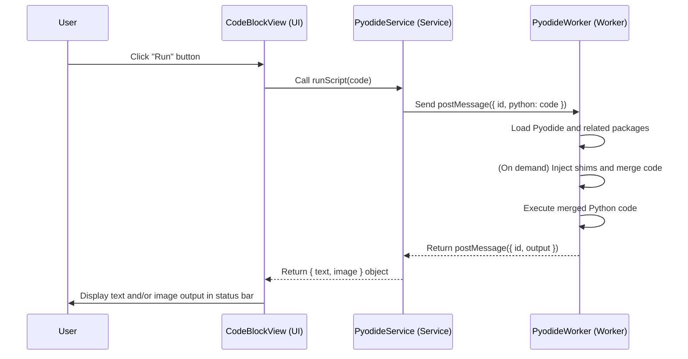

# Code Execution

This document describes the Python code execution feature for code blocks. The implementation uses [Pyodide][pyodide-link] to run Python code directly in the browser environment, placed inside a Web Worker to avoid blocking the main UI thread.

The entire implementation is divided into three main parts: UI Layer, Service Layer, and Worker Layer.

## Execution Flow



## 1. UI Layer

The user-facing code execution component is [CodeBlockView][codeblock-view-link].

### Key Mechanisms:

- **Run Button**: When the code block language is `python` and `codeExecution.enabled` is true, a "Run" button is conditionally rendered in `CodeToolbar`.
- **Event Handling**: The run button's `onClick` triggers the `handleRunScript` function.
- **Service Call**: `handleRunScript` calls `pyodideService.runScript(code)`, passing the Python code from the code block to the service.
- **State Management and Output Display**: Uses `executionResult` to manage all execution output; whenever there's any result (text or image), the [StatusBar][statusbar-link] component is rendered for unified display.

```typescript
// src/renderer/components/CodeBlockView/view.tsx
const [executionResult, setExecutionResult] = useState<{ text: string; image?: string } | null>(null)

const handleRunScript = useCallback(() => {
  setIsRunning(true)
  setExecutionResult(null)

  pyodideService
    .runScript(children, {}, codeExecution.timeoutMinutes * 60000)
    .then((result) => {
      setExecutionResult(result)
    })
    .catch((error) => {
      console.error('Unexpected error:', error)
      setExecutionResult({
        text: `Unexpected error: ${error.message || 'Unknown error'}`
      })
    })
    .finally(() => {
      setIsRunning(false)
    })
}, [children, codeExecution.timeoutMinutes]);

// ... in JSX
{isExecutable && executionResult && (
  <StatusBar>
    {executionResult.text}
    {executionResult.image && (
      <ImageOutput>
        
      </ImageOutput>
    )}
  </StatusBar>
)}
```

## 2. Service Layer

The service layer acts as a bridge between UI components and the Web Worker running Pyodide. Its logic is encapsulated in the singleton class [PyodideService][pyodide-service-link].

### Main Responsibilities:

- **Worker Management**: Initialize, manage, and communicate with the Pyodide Web Worker.
- **Request Handling**: Manage concurrent requests using a `resolvers` Map, matching requests and responses via unique IDs.
- **API for UI**: Expose the `runScript(script, context, timeout)` method to UI. Returns `Promise<{ text: string; image?: string }>` to support multiple output types including images.
- **Output Processing**: Receive `output` objects containing text, errors, and optional image data from the Worker. Format text and errors into a user-friendly string and return it along with image data to the UI layer.
- **IPC Endpoint**: The service also listens on `IpcChannel.Python_ExecutionRequest` (`python:execution-request`) and replies via `IpcChannel.Python_ExecutionResponse` (`python:execution-response`), allowing the main process to request Python code execution.

## 3. Worker Layer

The core Python execution happens inside the Web Worker defined in [pyodide.worker.ts][pyodide-worker-link]. This ensures computationally intensive Python code doesn't freeze the user interface.

### Worker Logic:

- **Pyodide Loading**: The Worker loads the Pyodide engine from CDN and sets up handlers to capture Python's `stdout` and `stderr`.
- **Dynamic Package Installation**: Uses `pyodide.loadPackagesFromImports()` to automatically analyze and install packages imported in the code.
- **On-demand Shim Execution**: The Worker checks if the incoming code contains "matplotlib". If so, it executes a Python "shim" first to ensure image output goes to the global namespace.
- **Result Serialization**: Execution results are recursively converted to serializable standard JavaScript objects via `.toJs()` and similar methods.
- **Structured Output**: After execution, the Worker sends a message back to the service layer containing `id` and an `output` object. The `output` is a structured object with `result`, `text`, `error`, and an optional `image` field (for Base64 image data).

### Data Flow

1. **UI Layer ([CodeBlockView][codeblock-view-link])**: User clicks the "Run" button.
2. **Service Layer ([PyodideService][pyodide-service-link])**:
   - Receives the code execution request.
   - Calls the Web Worker, passing user code.
3. **Worker Layer ([pyodide.worker.ts][pyodide-worker-link])**:
   - Loads the Pyodide runtime.
   - Dynamically installs packages declared in `import` statements.
   - **Injects Matplotlib shim**: If code contains `matplotlib`, prepends shim code that forces the `AGG` backend.
   - **Executes code and captures output**: After execution, checks all `matplotlib.pyplot` figures; if images exist, saves them to an in-memory `BytesIO` object and encodes as Base64 strings.
   - **Structured return**: Wraps captured text output and Base64 image data in a JSON object (`{ "text": "...", "image": "data:image/png;base64,..." }`) and returns it to the main thread.
4. **Service Layer ([PyodideService][pyodide-service-link])**:
   - Receives structured data from the Worker.
   - Passes data as-is to the UI layer.
5. **UI Layer ([CodeBlockView][codeblock-view-link])**:
   - Receives the object containing text and image data.
   - Uses `useState` to manage execution results (`executionResult`).
   - Renders text output and image (if present) in the interface.

<!-- Link Definitions -->

[pyodide-link]: https://pyodide.org/
[codeblock-view-link]: /src/renderer/components/CodeBlockView/view.tsx
[pyodide-service-link]: /src/renderer/services/PyodideService.ts
[pyodide-worker-link]: /src/renderer/workers/pyodide.worker.ts
[statusbar-link]: /src/renderer/components/CodeBlockView/StatusBar.tsx
