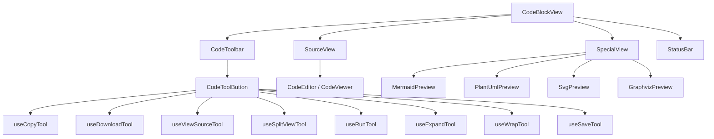
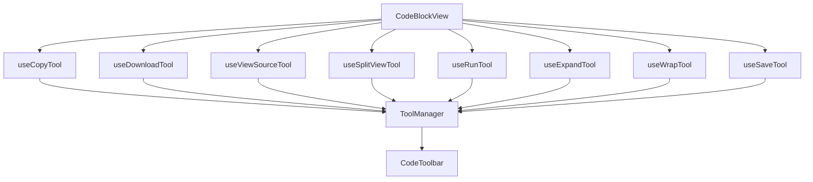
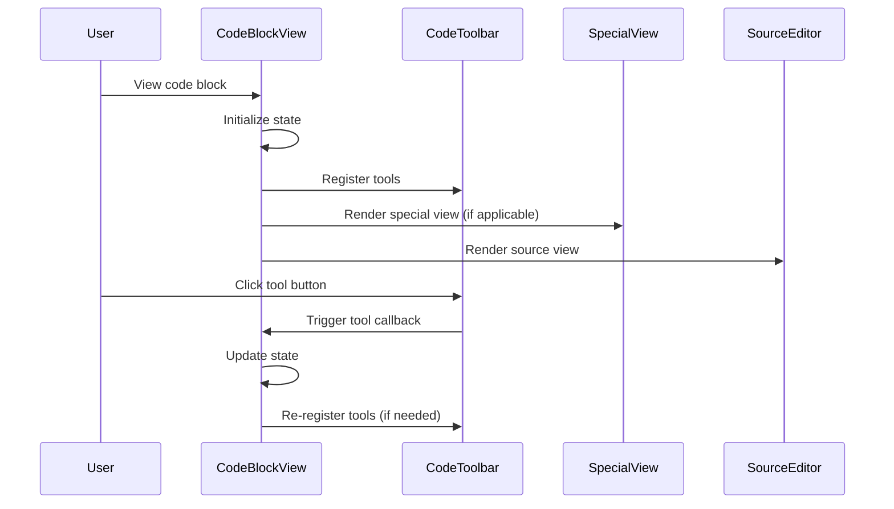

# CodeBlockView Component Structure

## Overview

CodeBlockView is the core component in Cherry Studio for displaying and manipulating code blocks. It supports multiple view modes and visual previews for special languages, providing rich interactive tools.

## Component Structure

## Core Concepts

### View Types

- **preview**: Preview view, where non-source code is displayed as special views
- **edit**: Edit view

### View Modes

- **source**: Source code view mode
- **special**: Special view mode (Mermaid, PlantUML, SVG)
- **split**: Split view mode (source code and special view displayed side by side)

### Special View Languages

- mermaid
- plantuml
- svg
- dot
- graphviz

## Component Details

### CodeBlockView Main Component

Main responsibilities:

1. Managing view mode state
2. Coordinating the display of source code view and special view
3. Managing toolbar tools
4. Handling code execution state

### Subcomponents

#### CodeToolbar

- Toolbar displayed at the top-right corner of the code block
- Contains core and quick tools
- Dynamically displays relevant tools based on context

#### CodeEditor/CodeViewer Source View

- Editable code editor or read-only code viewer
- Uses either component based on settings
- Supports syntax highlighting for multiple programming languages

#### Special View Components

- **MermaidPreview**: Mermaid diagram preview
- **PlantUmlPreview**: PlantUML diagram preview
- **SvgPreview**: SVG image preview
- **GraphvizPreview**: Graphviz diagram preview

All special view components share a common architecture for consistent user experience and functionality. For detailed information about these components and their implementation, see [Image Preview Components Documentation](./ImagePreview-en.md).

#### StatusBar

- Displays Python code execution results
- Can show both text and image results

## Tool System

CodeBlockView uses a hook-based tool system:

Each tool hook is responsible for registering specific function tool buttons to the tool manager, which then passes these tools to the CodeToolbar component for rendering.

### Tool Types

- **core**: Core tools, always displayed in the toolbar
- **quick**: Quick tools, displayed in a dropdown menu when there are more than one

### Tool List

1. **Copy**: Copy code or image
2. **Download**: Download code or image
3. **View Source**: Switch between special view and source code view
4. **Split View**: Toggle split view mode
5. **Run**: Run Python code
6. **Expand/Collapse**: Control code block expansion/collapse
7. **Wrap**: Control automatic line wrapping
8. **Save**: Save edited code

## State Management

CodeBlockView manages the following states through React hooks:

1. **viewMode**: Current view mode ('source' | 'special' | 'split')
2. **isRunning**: Python code execution status
3. **executionResult**: Python code execution result
4. **tools**: Toolbar tool list
5. **expandOverride/unwrapOverride**: User override settings for expand/wrap
6. **sourceScrollHeight**: Source code view scroll height

## Interaction Flow

## Special Handling

### HTML Code Blocks

HTML code blocks are specially handled using the HtmlArtifactsCard component.

### Python Code Execution

Supports executing Python code and displaying results using Pyodide to run Python code in the browser.
