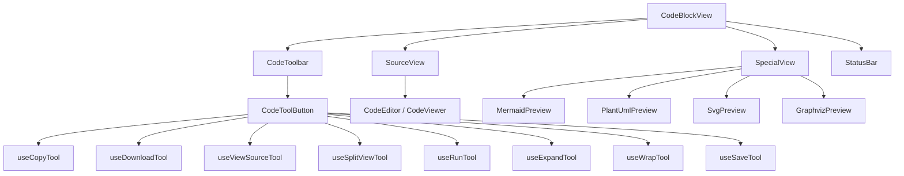
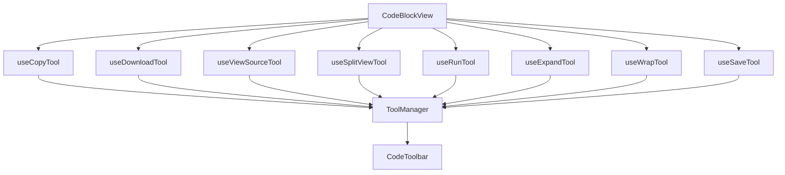
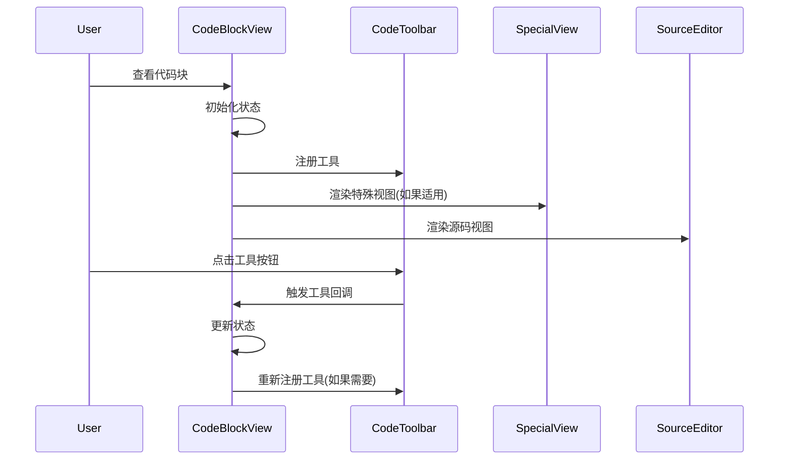

# CodeBlockView 组件结构说明

## 概述

CodeBlockView 是 Cherry Studio 中用于显示和操作代码块的核心组件。它支持多种视图模式和特殊语言的可视化预览，提供丰富的交互工具。

## 组件结构

## 核心概念

### 视图类型

- **preview**: 预览视图，非源代码的是特殊视图
- **edit**: 编辑视图

### 视图模式

- **source**: 源代码视图模式
- **special**: 特殊视图模式（Mermaid、PlantUML、SVG）
- **split**: 分屏模式（源代码和特殊视图并排显示）

### 特殊视图语言

- mermaid
- plantuml
- svg
- dot
- graphviz

## 组件详细说明

### CodeBlockView 主组件

主要负责：

1. 管理视图模式状态
2. 协调源代码视图和特殊视图的显示
3. 管理工具栏工具
4. 处理代码执行状态

### 子组件

#### CodeToolbar 工具栏

- 显示在代码块右上角的工具栏
- 包含核心(core)和快捷(quick)两类工具
- 根据上下文动态显示相关工具

#### CodeEditor/CodeViewer 源代码视图

- 可编辑的代码编辑器或只读的代码查看器
- 根据设置决定使用哪个组件
- 支持多种编程语言高亮

#### 特殊视图组件

- **MermaidPreview**: Mermaid 图表预览
- **PlantUmlPreview**: PlantUML 图表预览
- **SvgPreview**: SVG 图像预览
- **GraphvizPreview**: Graphviz 图表预览

所有特殊视图组件共享通用架构，以确保一致的用户体验和功能。有关这些组件及其实现的详细信息，请参阅 [图像预览组件文档](./ImagePreview-zh.md)。

#### StatusBar 状态栏

- 显示 Python 代码执行结果
- 可显示文本和图像结果

## 工具系统

CodeBlockView 使用基于 hooks 的工具系统：

每个工具 hook 负责注册特定功能的工具按钮到工具管理器，工具管理器再将这些工具传递给 CodeToolbar 组件进行渲染。

### 工具类型

- **core**: 核心工具，始终显示在工具栏
- **quick**: 快捷工具，当数量大于1时通过下拉菜单显示

### 工具列表

1. **复制(copy)**: 复制代码或图像
2. **下载(download)**: 下载代码或图像
3. **查看源码(view-source)**: 在特殊视图和源码视图间切换
4. **分屏(split-view)**: 切换分屏模式
5. **运行(run)**: 运行 Python 代码
6. **展开/折叠(expand)**: 控制代码块的展开/折叠
7. **换行(wrap)**: 控制代码的自动换行
8. **保存(save)**: 保存编辑的代码

## 状态管理

CodeBlockView 通过 React hooks 管理以下状态：

1. **viewMode**: 当前视图模式 ('source' | 'special' | 'split')
2. **isRunning**: Python 代码执行状态
3. **executionResult**: Python 代码执行结果
4. **tools**: 工具栏工具列表
5. **expandOverride/unwrapOverride**: 用户展开/换行的覆盖设置
6. **sourceScrollHeight**: 源代码视图滚动高度

## 交互流程

## 特殊处理

### HTML 代码块

HTML 代码块会被特殊处理，使用 HtmlArtifactsCard 组件显示。

### Python 代码执行

支持执行 Python 代码并显示结果，使用 Pyodide 在浏览器中运行 Python 代码。
