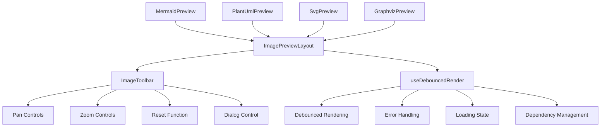

# Image Preview Components

## Overview

Image Preview Components are a set of specialized components in Cherry Studio for rendering and displaying various diagram and image formats. They provide a consistent user experience across different preview types with shared functionality for loading states, error handling, and interactive controls.

## Supported Formats

- **Mermaid**: Interactive diagrams and flowcharts
- **PlantUML**: UML diagrams and system architecture
- **SVG**: Scalable vector graphics
- **Graphviz/DOT**: Graph visualization and network diagrams

## Architecture



## Core Components

### ImagePreviewLayout

A common layout wrapper that provides the foundation for all image preview components.

**Features:**

- **Loading State Management**: Shows loading spinner during rendering
- **Error Display**: Displays error messages when rendering fails
- **Toolbar Integration**: Conditionally renders ImageToolbar when enabled
- **Container Management**: Wraps preview content with consistent styling
- **Responsive Design**: Adapts to different container sizes

**Props:**

- `children`: The preview content to be displayed
- `loading`: Boolean indicating if content is being rendered
- `error`: Error message to display if rendering fails
- `enableToolbar`: Whether to show the interactive toolbar
- `imageRef`: Reference to the container element for image manipulation

### ImageToolbar

Interactive toolbar component providing image manipulation controls.

**Features:**

- **Pan Controls**: 4-directional pan buttons (up, down, left, right)
- **Zoom Controls**: Zoom in/out functionality with configurable increments
- **Reset Function**: Restore original pan and zoom state
- **Dialog Control**: Open preview in expanded dialog view
- **Accessible Design**: Full keyboard navigation and screen reader support

**Layout:**

- 3x3 grid layout positioned at bottom-right of preview
- Responsive button sizing
- Tooltip support for all controls

### useDebouncedRender Hook

A specialized React hook for managing preview rendering with performance optimizations.

**Features:**

- **Debounced Rendering**: Prevents excessive re-renders during rapid content changes (default 300ms delay)
- **Automatic Dependency Management**: Handles dependencies for render and condition functions
- **Error Handling**: Catches and manages rendering errors with detailed error messages
- **Loading State**: Tracks rendering progress with automatic state updates
- **Conditional Rendering**: Supports pre-render condition checks
- **Manual Controls**: Provides trigger, cancel, and state management functions

**API:**

```typescript
const { containerRef, error, isLoading, triggerRender, cancelRender, clearError, setLoading } = useDebouncedRender(
  value,
  renderFunction,
  options
)
```

**Options:**

- `debounceDelay`: Customize debounce timing
- `shouldRender`: Function for conditional rendering logic

## Component Implementations

### MermaidPreview

Renders Mermaid diagrams with special handling for visibility detection.

**Special Features:**

- Syntax validation before rendering
- Visibility detection to handle collapsed containers
- SVG coordinate fixing for edge cases
- Integration with mermaid.js library

### PlantUmlPreview

Renders PlantUML diagrams using the online PlantUML server.

**Special Features:**

- Network error handling and retry logic
- Diagram encoding using deflate compression
- Support for light/dark themes
- Server status monitoring

### SvgPreview

Renders SVG content using Shadow DOM for isolation.

**Special Features:**

- Shadow DOM rendering for style isolation
- Direct SVG content injection
- Minimal processing overhead
- Cross-browser compatibility

### GraphvizPreview

Renders Graphviz/DOT diagrams using the viz.js library.

**Special Features:**

- Client-side rendering with viz.js
- Lazy loading of viz.js library
- SVG element generation
- Memory-efficient processing

## Shared Functionality

### Error Handling

All preview components provide consistent error handling:

- Network errors (connection failures)
- Syntax errors (invalid diagram code)
- Server errors (external service failures)
- Rendering errors (library failures)

### Loading States

Standardized loading indicators across all components:

- Spinner animation during processing
- Progress feedback for long operations
- Smooth transitions between states

### Interactive Controls

Common interaction patterns:

- Pan and zoom functionality
- Reset to original view
- Full-screen dialog mode
- Keyboard accessibility

### Performance Optimizations

- Debounced rendering to prevent excessive updates
- Lazy loading of heavy libraries
- Memory management for large diagrams
- Efficient re-rendering strategies

## Integration with CodeBlockView

Image Preview Components integrate seamlessly with CodeBlockView:

- Automatic format detection based on language tags
- Consistent toolbar integration
- Shared state management
- Responsive layout adaptation

For more information about the overall CodeBlockView architecture, see [CodeBlockView Documentation](./CodeBlockView-en.md).
