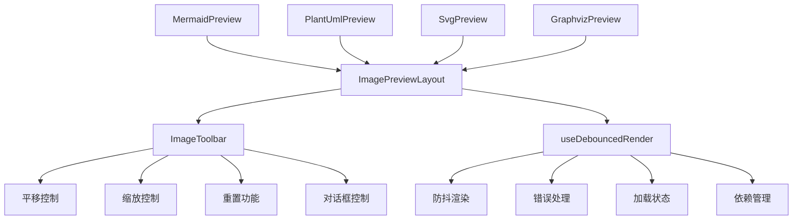

# 图像预览组件

## 概述

图像预览组件是 Cherry Studio 中用于渲染和显示各种图表和图像格式的专用组件集合。它们为不同预览类型提供一致的用户体验，具有共享的加载状态、错误处理和交互控制功能。

## 支持格式

- **Mermaid**: 交互式图表和流程图
- **PlantUML**: UML 图表和系统架构
- **SVG**: 可缩放矢量图形
- **Graphviz/DOT**: 图形可视化和网络图表

## 架构



## 核心组件

### ImagePreviewLayout 图像预览布局

为所有图像预览组件提供基础的通用布局包装器。

**功能特性:**

- **加载状态管理**: 在渲染期间显示加载动画
- **错误显示**: 渲染失败时显示错误信息
- **工具栏集成**: 启用时有条件地渲染 ImageToolbar
- **容器管理**: 使用一致的样式包装预览内容
- **响应式设计**: 适应不同的容器尺寸

**属性:**

- `children`: 要显示的预览内容
- `loading`: 指示内容是否正在渲染的布尔值
- `error`: 渲染失败时显示的错误信息
- `enableToolbar`: 是否显示交互式工具栏
- `imageRef`: 用于图像操作的容器元素引用

### ImageToolbar 图像工具栏

提供图像操作控制的交互式工具栏组件。

**功能特性:**

- **平移控制**: 4方向平移按钮（上、下、左、右）
- **缩放控制**: 放大/缩小功能，支持可配置的增量
- **重置功能**: 恢复原始平移和缩放状态
- **对话框控制**: 在展开对话框中打开预览
- **无障碍设计**: 完整的键盘导航和屏幕阅读器支持

**布局:**

- 3x3 网格布局，位于预览右下角
- 响应式按钮尺寸
- 所有控件的工具提示支持

### useDebouncedRender Hook 防抖渲染钩子

用于管理预览渲染的专用 React Hook，具有性能优化功能。

**功能特性:**

- **防抖渲染**: 防止内容快速变化时的过度重新渲染（默认 300ms 延迟）
- **自动依赖管理**: 处理渲染和条件函数的依赖项
- **错误处理**: 捕获和管理渲染错误，提供详细的错误信息
- **加载状态**: 跟踪渲染进度并自动更新状态
- **条件渲染**: 支持预渲染条件检查
- **手动控制**: 提供触发、取消和状态管理功能

**API:**

```typescript
const { containerRef, error, isLoading, triggerRender, cancelRender, clearError, setLoading } = useDebouncedRender(
  value,
  renderFunction,
  options
)
```

**选项:**

- `debounceDelay`: 自定义防抖时间
- `shouldRender`: 条件渲染逻辑函数

## 组件实现

### MermaidPreview Mermaid 预览

渲染 Mermaid 图表，具有可见性检测的特殊处理。

**特殊功能:**

- 渲染前语法验证
- 可见性检测以处理折叠的容器
- 边缘情况的 SVG 坐标修复
- 与 mermaid.js 库集成

### PlantUmlPreview PlantUML 预览

使用在线 PlantUML 服务器渲染 PlantUML 图表。

**特殊功能:**

- 网络错误处理和重试逻辑
- 使用 deflate 压缩的图表编码
- 支持明/暗主题
- 服务器状态监控

### SvgPreview SVG 预览

使用 Shadow DOM 隔离渲染 SVG 内容。

**特殊功能:**

- Shadow DOM 渲染实现样式隔离
- 直接 SVG 内容注入
- 最小化处理开销
- 跨浏览器兼容性

### GraphvizPreview Graphviz 预览

使用 viz.js 库渲染 Graphviz/DOT 图表。

**特殊功能:**

- 使用 viz.js 进行客户端渲染
- viz.js 库的懒加载
- SVG 元素生成
- 内存高效处理

## 共享功能

### 错误处理

所有预览组件提供一致的错误处理：

- 网络错误（连接失败）
- 语法错误（无效的图表代码）
- 服务器错误（外部服务失败）
- 渲染错误（库失败）

### 加载状态

所有组件的标准化加载指示器：

- 处理期间的动画
- 长时间操作的进度反馈
- 状态间的平滑过渡

### 交互控制

通用交互模式：

- 平移和缩放功能
- 重置到原始视图
- 全屏对话框模式
- 键盘无障碍访问

### 性能优化

- 防抖渲染以防止过度更新
- 重型库的懒加载
- 大型图表的内存管理
- 高效的重新渲染策略

## 与 CodeBlockView 的集成

图像预览组件与 CodeBlockView 无缝集成：

- 基于语言标签的自动格式检测
- 一致的工具栏集成
- 共享状态管理
- 响应式布局适应

有关整体 CodeBlockView 架构的更多信息，请参阅 [CodeBlockView 文档](./CodeBlockView-zh.md)。
