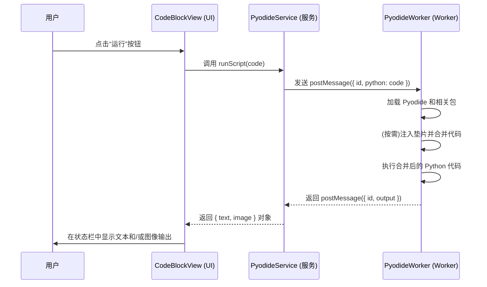

# 代码执行功能

本文档说明了代码块的 Python 代码执行功能。该实现利用 [Pyodide][pyodide-link] 在浏览器环境中直接运行 Python 代码，并将其置于 Web Worker 中，以避免阻塞主 UI 线程。

整个实现分为三个主要部分：UI 层、服务层和 Worker 层。

## 执行流程图



## 1. UI 层

面向用户的代码执行组件是 [CodeBlockView][codeblock-view-link]。

### 关键机制：

- **运行按钮**：当代码块语言为 `python` 且 `codeExecution.enabled` 设置为 true 时，`CodeToolbar` 中会条件性地渲染一个“运行”按钮。
- **事件处理**：运行按钮的 `onClick` 事件会触发 `handleRunScript` 函数。
- **服务调用**：`handleRunScript` 调用 `pyodideService.runScript(code)`，将代码块中的 Python 代码传递给服务。
- **状态管理与输出显示**：使用 `executionResult` 来管理所有执行输出，只要有任何结果（文本或图像），[StatusBar][statusbar-link] 组件就会被渲染以统一显示。

```typescript
// src/renderer/src/components/CodeBlockView/view.tsx
const [executionResult, setExecutionResult] = useState<{ text: string; image?: string } | null>(null)

const handleRunScript = useCallback(() => {
  setIsRunning(true)
  setExecutionResult(null)

  pyodideService
    .runScript(children, {}, codeExecution.timeoutMinutes * 60000)
    .then((result) => {
      setExecutionResult(result)
    })
    .catch((error) => {
      console.error('Unexpected error:', error)
      setExecutionResult({
        text: `Unexpected error: ${error.message || 'Unknown error'}`
      })
    })
    .finally(() => {
      setIsRunning(false)
    })
}, [children, codeExecution.timeoutMinutes]);

// ... 在 JSX 中
{isExecutable && executionResult && (
  <StatusBar>
    {executionResult.text}
    {executionResult.image && (
      <ImageOutput>
        
      </ImageOutput>
    )}
  </StatusBar>
)}
```

## 2. 服务层

服务层充当 UI 组件和运行 Pyodide 的 Web Worker 之间的桥梁。其逻辑封装在位于单例类 [PyodideService][pyodide-service-link]。

### 主要职责：

- **Worker 管理**：初始化、管理并与 Pyodide Web Worker 通信。
- **请求处理**：使用 `resolvers` Map 管理并发请求，通过唯一 ID 匹配请求和响应。
- **为 UI 提供 API**：向 UI 提供 `runScript(script, context, timeout)` 方法。此方法的返回值已修改为 `Promise<{ text: string; image?: string }>`，以支持包括图像在内的多种输出类型。
- **输出处理**：从 Worker 接收包含文本、错误和可选图像数据的 `output` 对象。它将文本和错误格式化为对用户友好的单个字符串，然后连同图像数据一起包装成对象返回给 UI 层。
- **IPC 端点**：该服务还提供了一个 `python-execution-request` IPC 端点，允许主进程请求执行 Python 代码，展示了其灵活的架构。

## 3. Worker 层

核心的 Python 执行发生在 [pyodide.worker.ts][pyodide-worker-link] 中定义的 Web Worker 内部。这确保了计算密集的 Python 代码不会冻结用户界面。

### Worker 逻辑：

- **Pyodide 加载**：Worker 从 CDN 加载 Pyodide 引擎，并设置处理器以捕获 Python 的 `stdout` 和 `stderr`。
- **动态包安装**：使用 `pyodide.loadPackagesFromImports()` 自动分析并安装代码中导入的依赖包。
- **按需执行垫片代码**：Worker 会检查传入的代码中是否包含 "matplotlib" 字符串。如果是，它会先执行一段 Python“垫片”代码确保图像输出到全局命名空间。
- **结果序列化**：执行结果通过 `.toJs()` 等方法被递归转换为可序列化的标准 JavaScript 对象。
- **返回结构化输出**：执行后，Worker 将一个包含 `id` 和 `output` 对象的-消息发回服务层。`output` 对象是一个结构化对象，包含 `result`、`text`、`error` 以及一个可选的 `image` 字段（用于 Base64 图像数据）。

### 数据流

最终的数据流如下：

1.  **UI 层 ([CodeBlockView][codeblock-view-link])**: 用户点击“运行”按钮。
2.  **服务层 ([PyodideService][pyodide-service-link])**:
    - 接收到代码执行请求。
    - 调用 Web Worker ([pyodide.worker.ts][pyodide-worker-link])，传递用户代码。
3.  **Worker 层 ([pyodide.worker.ts][pyodide-worker-link])**:
    - 加载 Pyodide 运行时。
    - 动态安装代码中 `import` 语句声明的依赖包。
    - **注入 Matplotlib 垫片**: 如果代码中包含 `matplotlib`，则在用户代码前拼接垫片代码，强制使用 `AGG` 后端。
    - **执行代码并捕获输出**: 在代码执行后，检查 `matplotlib.pyplot` 的所有 figure，如果存在图像，则将其保存到内存中的 `BytesIO` 对象，并编码为 Base64 字符串。
    - **结构化返回**: 将捕获的文本输出和 Base64 图像数据封装在一个 JSON 对象中 (`{ "text": "...", "image": "data:image/png;base64,..." }`) 返回给主线程。
4.  **服务层 ([PyodideService][pyodide-service-link])**:
    - 接收来自 Worker 的结构化数据。
    - 将数据原样传递给 UI 层。
5.  **UI 层 ([CodeBlockView][codeblock-view-link])**:
    - 接收包含文本和图像数据的对象。
    - 使用一个 `useState` 来管理执行结果 (`executionResult`)。
    - 在界面上分别渲染文本输出和图像（如果存在）。

<!-- Link Definitions -->

[pyodide-link]: https://pyodide.org/
[codeblock-view-link]: /src/renderer/src/components/CodeBlockView/view.tsx
[pyodide-service-link]: /src/renderer/src/services/PyodideService.ts
[pyodide-worker-link]: /src/renderer/src/workers/pyodide.worker.ts
[statusbar-link]: /src/renderer/src/components/CodeBlockView/StatusBar.tsx
