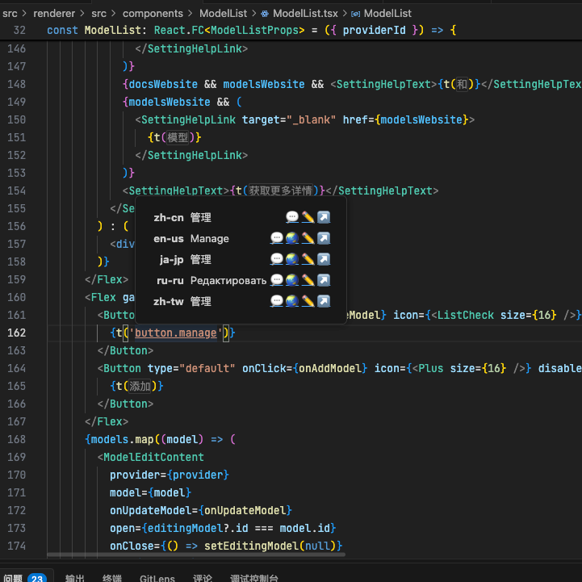
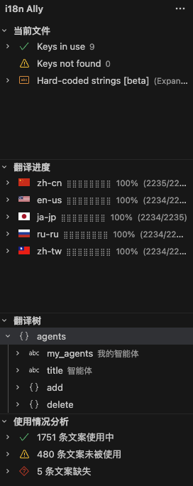
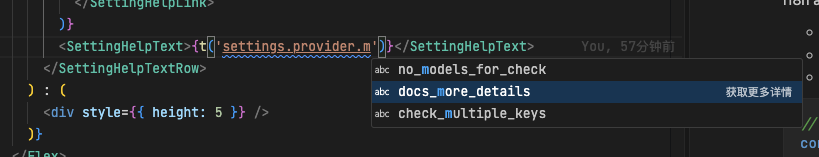

# 如何优雅地做好 i18n

## 使用i18n ally插件提升开发体验

i18n ally是一个强大的VSCode插件，它能在开发阶段提供实时反馈，帮助开发者更早发现文案缺失和错译问题。

项目中已经配置好了插件设置，直接安装即可。

### 开发时优势

- **实时预览**：翻译文案会直接显示在编辑器中
- **错误检测**：自动追踪标记出缺失的翻译或未使用的key
- **快速跳转**：可通过key直接跳转到定义处（Ctrl/Cmd + click)
- **自动补全**：输入i18n key时提供自动补全建议

### 效果展示







## i18n 约定

### **绝对避免使用flat格式**

绝对避免使用flat格式，如`"add.button.tip": "添加"`。应采用清晰的嵌套结构：

```json
// 错误示例 - flat结构
{
  "add.button.tip": "添加",
  "delete.button.tip": "删除"
}

// 正确示例 - 嵌套结构
{
  "add": {
    "button": {
      "tip": "添加"
    }
  },
  "delete": {
    "button": {
      "tip": "删除"
    }
  }
}
```

#### 为什么要使用嵌套结构

1. **自然分组**：通过对象结构天然能将相关上下文的文案分到一个组别中
2. **插件要求**：i18n ally 插件需要嵌套或flat格式其一的文件才能正常分析

### **避免在`t()`中使用模板字符串**

**强烈建议避免使用模板字符串**进行动态插值。虽然模板字符串在JavaScript开发中非常方便，但在国际化场景下会带来一系列问题。

1. **插件无法跟踪**
   i18n ally等工具无法解析模板字符串中的动态内容，导致：

   - 无法正确显示实时预览
   - 无法检测翻译缺失
   - 无法提供跳转到定义的功能

   ```javascript
   // 不推荐 - 插件无法解析
   const message = t(`fruits.${fruit}`)
   ```

2. **编辑器无法实时渲染**
   在IDE中，模板字符串会显示为原始代码而非最终翻译结果，降低了开发体验。

3. **更难以维护**
   由于插件无法跟踪这样的文案，编辑器中也无法渲染，开发者必须人工确认语言文件中是否存在相应的文案。

### 推荐做法

为了避免键的缺失，所有需要动态翻译的文本都应当先维护一个`FooKeyMap`，再通过函数获取翻译文本。

例如：

```ts
// src/renderer/src/i18n/label.ts
const themeModeKeyMap = {
  dark: 'settings.theme.dark',
  light: 'settings.theme.light',
  system: 'settings.theme.system'
} as const

export const getThemeModeLabel = (key: string): string => {
  return themeModeKeyMap[key] ? t(themeModeKeyMap[key]) : key
}
```

通过避免模板字符串，可以获得更好的开发体验、更可靠的翻译检查以及更易维护的代码库。

## 自动化脚本

项目中有一系列脚本来自动化i18n相关任务：

### `check:i18n` - 检查i18n结构

此脚本会检查：

- 所有语言文件是否为嵌套结构
- 是否存在缺失的key
- 是否存在多余的key
- 是否已经有序

```bash
yarn check:i18n
```

### `sync:i18n` - 同步json结构与排序

此脚本以`zh-cn.json`文件为基准，将结构同步到其他语言文件，包括：

1. 添加缺失的键。缺少的翻译内容会以`[to be translated]`标记
2. 删除多余的键
3. 自动排序

```bash
yarn sync:i18n
```

### `auto:i18n` - 自动翻译待翻译文本

次脚本自动将标记为待翻译的文本通过机器翻译填充。

通常，在`zh-cn.json`中添加所需文案后，执行`sync:i18n`即可自动完成翻译。

使用该脚本前，需要配置环境变量，例如：

```bash
API_KEY="sk-xxx"
BASE_URL="https://dashscope.aliyuncs.com/compatible-mode/v1/"
MODEL="qwen-plus-latest"
```

你也可以通过直接编辑`.env`文件来添加环境变量。

```bash
yarn auto:i18n
```

### `update:i18n` - 对象级别翻译更新

对`src/renderer/src/i18n/translate`中的语言文件进行对象级别的翻译更新，保留已有翻译，只更新新增内容。

**不建议**使用该脚本，更推荐使用`auto:i18n`进行翻译。

```bash
yarn update:i18n
```

### 工作流

1. 开发阶段，先在`zh-cn.json`中添加所需文案
2. 确认在中文环境下显示无误后，使用`yarn sync:i18n`将文案同步到其他语言文件
3. 使用`yarn auto:i18n`进行自动翻译
4. 喝杯咖啡，等翻译完成吧！

## 最佳实践

1. **以中文为源语言**：所有开发首先使用中文，再翻译为其他语言
2. **提交前运行检查脚本**：使用`yarn check:i18n`检查i18n是否有问题
3. **小步提交翻译**：避免积累大量未翻译文本
4. **保持key语义明确**：key应能清晰表达其用途，如`user.profile.avatar.upload.error`
