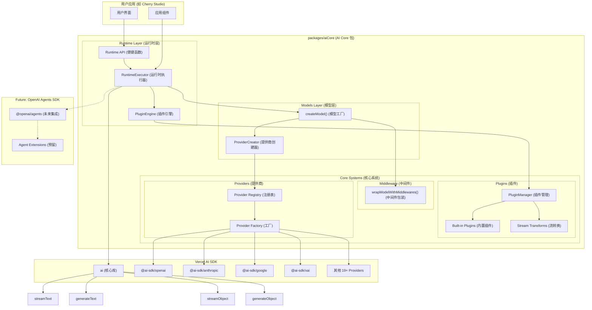

# AI Core 基于 Vercel AI SDK 的技术架构

## 1. 架构设计理念

### 1.1 设计目标

- **简化分层**：`models`（模型层）→ `runtime`（运行时层），清晰的职责分离
- **统一接口**：使用 Vercel AI SDK 统一不同 AI Provider 的接口差异
- **动态导入**：通过动态导入实现按需加载，减少打包体积
- **最小包装**：直接使用 AI SDK 的类型和接口，避免重复定义
- **插件系统**：基于钩子的通用插件架构，支持请求全生命周期扩展
- **类型安全**：利用 TypeScript 和 AI SDK 的类型系统确保类型安全
- **轻量级**：专注核心功能，保持包的轻量和高效
- **包级独立**：作为独立包管理，便于复用和维护
- **Agent就绪**：为将来集成 OpenAI Agents SDK 预留扩展空间

### 1.2 核心优势

- **标准化**：AI SDK 提供统一的模型接口，减少适配工作
- **简化设计**：函数式API，避免过度抽象
- **更好的开发体验**：完整的 TypeScript 支持和丰富的生态系统
- **性能优化**：AI SDK 内置优化和最佳实践
- **模块化设计**：独立包结构，支持跨项目复用
- **可扩展插件**：通用的流转换和参数处理插件系统
- **面向未来**：为 OpenAI Agents SDK 集成做好准备

## 2. 整体架构图



## 3. 包结构设计

### 3.1 新架构文件结构

```
packages/aiCore/
├── src/
│   ├── core/                        # 核心层 - 内部实现
│   │   ├── models/                  # 模型层 - 模型创建和配置
│   │   │   ├── factory.ts           # 模型工厂函数 ✅
│   │   │   ├── ModelCreator.ts      # 模型创建器 ✅
│   │   │   ├── ConfigManager.ts     # 配置管理器 ✅
│   │   │   ├── types.ts             # 模型类型定义 ✅
│   │   │   └── index.ts             # 模型层导出 ✅
│   │   ├── runtime/                 # 运行时层 - 执行和用户API
│   │   │   ├── executor.ts          # 运行时执行器 ✅
│   │   │   ├── pluginEngine.ts      # 插件引擎 ✅
│   │   │   ├── types.ts             # 运行时类型定义 ✅
│   │   │   └── index.ts             # 运行时导出 ✅
│   │   ├── middleware/              # 中间件系统
│   │   │   ├── wrapper.ts           # 模型包装器 ✅
│   │   │   ├── manager.ts           # 中间件管理器 ✅
│   │   │   ├── types.ts             # 中间件类型 ✅
│   │   │   └── index.ts             # 中间件导出 ✅
│   │   ├── plugins/                 # 插件系统
│   │   │   ├── types.ts             # 插件类型定义 ✅
│   │   │   ├── manager.ts           # 插件管理器 ✅
│   │   │   ├── built-in/            # 内置插件 ✅
│   │   │   │   ├── logging.ts       # 日志插件 ✅
│   │   │   │   ├── webSearchPlugin/ # 网络搜索插件 ✅
│   │   │   │   ├── toolUsePlugin/   # 工具使用插件 ✅
│   │   │   │   └── index.ts         # 内置插件导出 ✅
│   │   │   ├── README.md            # 插件文档 ✅
│   │   │   └── index.ts             # 插件导出 ✅
│   │   ├── providers/               # 提供商管理
│   │   │   ├── registry.ts          # 提供商注册表 ✅
│   │   │   ├── factory.ts           # 提供商工厂 ✅
│   │   │   ├── creator.ts           # 提供商创建器 ✅
│   │   │   ├── types.ts             # 提供商类型 ✅
│   │   │   ├── utils.ts             # 工具函数 ✅
│   │   │   └── index.ts             # 提供商导出 ✅
│   │   ├── options/                 # 配置选项
│   │   │   ├── factory.ts           # 选项工厂 ✅
│   │   │   ├── types.ts             # 选项类型 ✅
│   │   │   ├── xai.ts               # xAI 选项 ✅
│   │   │   ├── openrouter.ts        # OpenRouter 选项 ✅
│   │   │   ├── examples.ts          # 示例配置 ✅
│   │   │   └── index.ts             # 选项导出 ✅
│   │   └── index.ts                 # 核心层导出 ✅
│   ├── types.ts                     # 全局类型定义 ✅
│   └── index.ts                     # 包主入口文件 ✅
├── package.json                     # 包配置文件 ✅
├── tsconfig.json                    # TypeScript 配置 ✅
├── README.md                        # 包说明文档 ✅
└── AI_SDK_ARCHITECTURE.md           # 本文档 ✅
```

## 4. 架构分层详解

### 4.1 Models Layer (模型层)

**职责**：统一的模型创建和配置管理

**核心文件**：

- `factory.ts`: 模型工厂函数 (`createModel`, `createModels`)
- `ProviderCreator.ts`: 底层提供商创建和模型实例化
- `types.ts`: 模型配置类型定义

**设计特点**：

- 函数式设计，避免不必要的类抽象
- 统一的模型配置接口
- 自动处理中间件应用
- 支持批量模型创建

**核心API**：

```typescript
// 模型配置接口
export interface ModelConfig {
  providerId: ProviderId
  modelId: string
  options: ProviderSettingsMap[ProviderId]
  middlewares?: LanguageModelV1Middleware[]
}

// 核心模型创建函数
export async function createModel(config: ModelConfig): Promise<LanguageModel>
export async function createModels(configs: ModelConfig[]): Promise<LanguageModel[]>
```

### 4.2 Runtime Layer (运行时层)

**职责**：运行时执行器和用户面向的API接口

**核心组件**：

- `executor.ts`: 运行时执行器类
- `plugin-engine.ts`: 插件引擎（原PluginEnabledAiClient）
- `index.ts`: 便捷函数和工厂方法

**设计特点**：

- 提供三种使用方式：类实例、静态工厂、函数式调用
- 自动集成模型创建和插件处理
- 完整的类型安全支持
- 为 OpenAI Agents SDK 预留扩展接口

**核心API**：

```typescript
// 运行时执行器
export class RuntimeExecutor<T extends ProviderId = ProviderId> {
  static create<T extends ProviderId>(
    providerId: T,
    options: ProviderSettingsMap[T],
    plugins?: AiPlugin[]
  ): RuntimeExecutor<T>

  async streamText(modelId: string, params: StreamTextParams): Promise<StreamTextResult>
  async generateText(modelId: string, params: GenerateTextParams): Promise<GenerateTextResult>
  async streamObject(modelId: string, params: StreamObjectParams): Promise<StreamObjectResult>
  async generateObject(modelId: string, params: GenerateObjectParams): Promise<GenerateObjectResult>
}

// 便捷函数式API
export async function streamText<T extends ProviderId>(
  providerId: T,
  options: ProviderSettingsMap[T],
  modelId: string,
  params: StreamTextParams,
  plugins?: AiPlugin[]
): Promise<StreamTextResult>
```

### 4.3 Plugin System (插件系统)

**职责**：可扩展的插件架构

**核心组件**：

- `PluginManager`: 插件生命周期管理
- `built-in/`: 内置插件集合
- 流转换收集和应用

**设计特点**：

- 借鉴 Rollup 的钩子分类设计
- 支持流转换 (`experimental_transform`)
- 内置常用插件（日志、计数等）
- 完整的生命周期钩子

**插件接口**：

```typescript
export interface AiPlugin {
  name: string
  enforce?: 'pre' | 'post'

  // 【First】首个钩子 - 只执行第一个返回值的插件
  resolveModel?: (modelId: string, context: AiRequestContext) => string | null | Promise<string | null>
  loadTemplate?: (templateName: string, context: AiRequestContext) => any | null | Promise<any | null>

  // 【Sequential】串行钩子 - 链式执行，支持数据转换
  transformParams?: (params: any, context: AiRequestContext) => any | Promise<any>
  transformResult?: (result: any, context: AiRequestContext) => any | Promise<any>

  // 【Parallel】并行钩子 - 不依赖顺序，用于副作用
  onRequestStart?: (context: AiRequestContext) => void | Promise<void>
  onRequestEnd?: (context: AiRequestContext, result: any) => void | Promise<void>
  onError?: (error: Error, context: AiRequestContext) => void | Promise<void>

  // 【Stream】流处理
  transformStream?: () => TransformStream
}
```

### 4.4 Middleware System (中间件系统)

**职责**：AI SDK原生中间件支持

**核心组件**：

- `ModelWrapper.ts`: 模型包装函数

**设计哲学**：

- 直接使用AI SDK的 `wrapLanguageModel`
- 与插件系统分离，职责明确
- 函数式设计，简化使用

```typescript
export function wrapModelWithMiddlewares(model: LanguageModel, middlewares: LanguageModelV1Middleware[]): LanguageModel
```

### 4.5 Provider System (提供商系统)

**职责**：AI Provider注册表和动态导入

**核心组件**：

- `registry.ts`: 19+ Provider配置和类型
- `factory.ts`: Provider配置工厂

**支持的Providers**：

- OpenAI, Anthropic, Google, XAI
- Azure OpenAI, Amazon Bedrock, Google Vertex
- Groq, Together.ai, Fireworks, DeepSeek
- 等19+ AI SDK官方支持的providers

## 5. 使用方式

### 5.1 函数式调用 (推荐 - 简单场景)

```typescript
import { streamText, generateText } from '@cherrystudio/ai-core/runtime'

// 直接函数调用
const stream = await streamText(
  'anthropic',
  { apiKey: 'your-api-key' },
  'claude-3',
  { messages: [{ role: 'user', content: 'Hello!' }] },
  [loggingPlugin]
)
```

### 5.2 执行器实例 (推荐 - 复杂场景)

```typescript
import { createExecutor } from '@cherrystudio/ai-core/runtime'

// 创建可复用的执行器
const executor = createExecutor('openai', { apiKey: 'your-api-key' }, [plugin1, plugin2])

// 多次使用
const stream = await executor.streamText('gpt-4', {
  messages: [{ role: 'user', content: 'Hello!' }]
})

const result = await executor.generateText('gpt-4', {
  messages: [{ role: 'user', content: 'How are you?' }]
})
```

### 5.3 静态工厂方法

```typescript
import { RuntimeExecutor } from '@cherrystudio/ai-core/runtime'

// 静态创建
const executor = RuntimeExecutor.create('anthropic', { apiKey: 'your-api-key' })
await executor.streamText('claude-3', { messages: [...] })
```

### 5.4 直接模型创建 (高级用法)

```typescript
import { createModel } from '@cherrystudio/ai-core/models'
import { streamText } from 'ai'

// 直接创建模型使用
const model = await createModel({
  providerId: 'openai',
  modelId: 'gpt-4',
  options: { apiKey: 'your-api-key' },
  middlewares: [middleware1, middleware2]
})

// 直接使用 AI SDK
const result = await streamText({ model, messages: [...] })
```

## 6. 为 OpenAI Agents SDK 预留的设计

### 6.1 架构兼容性

当前架构完全兼容 OpenAI Agents SDK 的集成需求：

```typescript
// 当前的模型创建
const model = await createModel({
  providerId: 'anthropic',
  modelId: 'claude-3',
  options: { apiKey: 'xxx' }
})

// 将来可以直接用于 OpenAI Agents SDK
import { Agent, run } from '@openai/agents'

const agent = new Agent({
  model, // ✅ 直接兼容 LanguageModel 接口
  name: 'Assistant',
  instructions: '...',
  tools: [tool1, tool2]
})

const result = await run(agent, 'user input')
```

### 6.2 预留的扩展点

1. **runtime/agents/** 目录预留
2. **AgentExecutor** 类预留
3. **Agent工具转换插件** 预留
4. **多Agent编排** 预留

### 6.3 未来架构扩展

```
packages/aiCore/src/core/
├── runtime/
│   ├── agents/              # 🚀 未来添加
│   │   ├── AgentExecutor.ts
│   │   ├── WorkflowManager.ts
│   │   └── ConversationManager.ts
│   ├── executor.ts
│   └── index.ts
```

## 7. 架构优势

### 7.1 简化设计

- **移除过度抽象**：删除了orchestration层和creation层的复杂包装
- **函数式优先**：models层使用函数而非类
- **直接明了**：runtime层直接提供用户API

### 7.2 职责清晰

- **Models**: 专注模型创建和配置
- **Runtime**: 专注执行和用户API
- **Plugins**: 专注扩展功能
- **Providers**: 专注AI Provider管理

### 7.3 类型安全

- 完整的 TypeScript 支持
- AI SDK 类型的直接复用
- 避免类型重复定义

### 7.4 灵活使用

- 三种使用模式满足不同需求
- 从简单函数调用到复杂执行器
- 支持直接AI SDK使用

### 7.5 面向未来

- 为 OpenAI Agents SDK 集成做好准备
- 清晰的扩展点和架构边界
- 模块化设计便于功能添加

## 8. 技术决策记录

### 8.1 为什么选择简化的两层架构？

- **职责分离**：models专注创建，runtime专注执行
- **模块化**：每层都有清晰的边界和职责
- **扩展性**：为Agent功能预留了清晰的扩展空间

### 8.2 为什么选择函数式设计？

- **简洁性**：避免不必要的类设计
- **性能**：减少对象创建开销
- **易用性**：函数调用更直观

### 8.3 为什么分离插件和中间件？

- **职责明确**: 插件处理应用特定需求
- **原生支持**: 中间件使用AI SDK原生功能
- **灵活性**: 两套系统可以独立演进

## 9. 总结

AI Core架构实现了：

### 9.1 核心特点

- ✅ **简化架构**: 2层核心架构，职责清晰
- ✅ **函数式设计**: models层完全函数化
- ✅ **类型安全**: 统一的类型定义和AI SDK类型复用
- ✅ **插件扩展**: 强大的插件系统
- ✅ **多种使用方式**: 满足不同复杂度需求
- ✅ **Agent就绪**: 为OpenAI Agents SDK集成做好准备

### 9.2 核心价值

- **统一接口**: 一套API支持19+ AI providers
- **灵活使用**: 函数式、实例式、静态工厂式
- **强类型**: 完整的TypeScript支持
- **可扩展**: 插件和中间件双重扩展能力
- **高性能**: 最小化包装，直接使用AI SDK
- **面向未来**: Agent SDK集成架构就绪

### 9.3 未来发展

这个架构提供了：

- **优秀的开发体验**: 简洁的API和清晰的使用模式
- **强大的扩展能力**: 为Agent功能预留了完整的架构空间
- **良好的维护性**: 职责分离明确，代码易于维护
- **广泛的适用性**: 既适合简单调用也适合复杂应用
