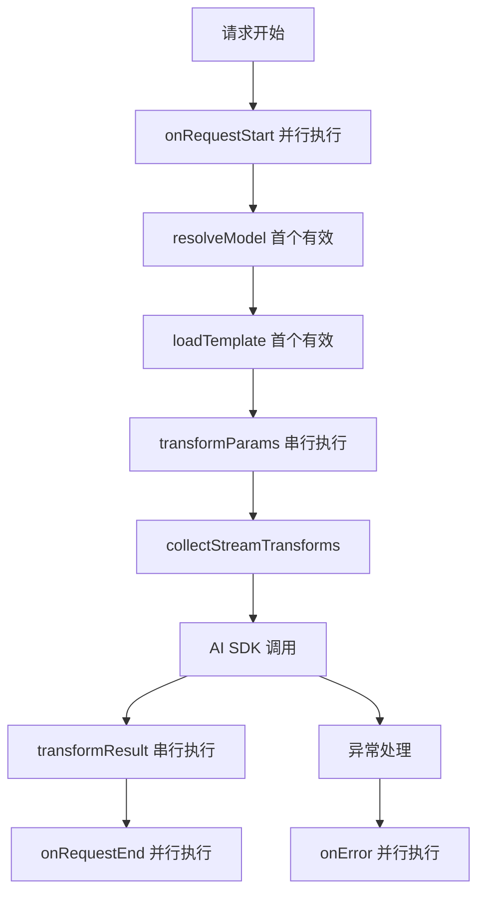

# AI Core 插件系统

支持四种钩子类型：**First**、**Sequential**、**Parallel** 和 **Stream**。

## 🎯 设计理念

- **语义清晰**：不同钩子有不同的执行语义
- **类型安全**：TypeScript 完整支持
- **性能优化**：First 短路、Parallel 并发、Sequential 链式
- **易于扩展**：`enforce` 排序 + 功能分类

## 📋 钩子类型

### 🥇 First 钩子 - 首个有效结果

```typescript
// 只执行第一个返回值的插件，用于解析和查找
resolveModel?: (modelId: string, context: AiRequestContext) => string | null
loadTemplate?: (templateName: string, context: AiRequestContext) => any | null
```

### 🔄 Sequential 钩子 - 链式数据转换

```typescript
// 按顺序链式执行，每个插件可以修改数据
transformParams?: (params: any, context: AiRequestContext) => any
transformResult?: (result: any, context: AiRequestContext) => any
```

### ⚡ Parallel 钩子 - 并行副作用

```typescript
// 并发执行，用于日志、监控等副作用
onRequestStart?: (context: AiRequestContext) => void
onRequestEnd?: (context: AiRequestContext, result: any) => void
onError?: (error: Error, context: AiRequestContext) => void
```

### 🌊 Stream 钩子 - 流处理

```typescript
// 直接使用 AI SDK 的 TransformStream
transformStream?: () => (options) => TransformStream<TextStreamPart, TextStreamPart>
```

## 🚀 快速开始

### 基础用法

```typescript
import { PluginManager, createContext, definePlugin } from '@cherrystudio/ai-core/middleware'

// 创建插件管理器
const pluginManager = new PluginManager()

// 添加插件
pluginManager.use({
  name: 'my-plugin',
  async transformParams(params, context) {
    return { ...params, temperature: 0.7 }
  }
})

// 使用插件
const context = createContext('openai', 'gpt-4', { messages: [] })
const transformedParams = await pluginManager.executeSequential(
  'transformParams',
  { messages: [{ role: 'user', content: 'Hello' }] },
  context
)
```

### 完整示例

```typescript
import {
  PluginManager,
  ModelAliasPlugin,
  LoggingPlugin,
  ParamsValidationPlugin,
  createContext
} from '@cherrystudio/ai-core/middleware'

// 创建插件管理器
const manager = new PluginManager([
  ModelAliasPlugin, // 模型别名解析
  ParamsValidationPlugin, // 参数验证
  LoggingPlugin // 日志记录
])

// AI 请求流程
async function aiRequest(providerId: string, modelId: string, params: any) {
  const context = createContext(providerId, modelId, params)

  try {
    // 1. 【并行】触发请求开始事件
    await manager.executeParallel('onRequestStart', context)

    // 2. 【首个】解析模型别名
    const resolvedModel = await manager.executeFirst('resolveModel', modelId, context)
    context.modelId = resolvedModel || modelId

    // 3. 【串行】转换请求参数
    const transformedParams = await manager.executeSequential('transformParams', params, context)

    // 4. 【流处理】收集流转换器（AI SDK 原生支持数组）
    const streamTransforms = manager.collectStreamTransforms()

    // 5. 调用 AI SDK（这里省略具体实现）
    const result = await callAiSdk(transformedParams, streamTransforms)

    // 6. 【串行】转换响应结果
    const transformedResult = await manager.executeSequential('transformResult', result, context)

    // 7. 【并行】触发请求完成事件
    await manager.executeParallel('onRequestEnd', context, transformedResult)

    return transformedResult
  } catch (error) {
    // 8. 【并行】触发错误事件
    await manager.executeParallel('onError', context, undefined, error)
    throw error
  }
}
```

## 🔧 自定义插件

### 模型别名插件

```typescript
const ModelAliasPlugin = definePlugin({
  name: 'model-alias',
  enforce: 'pre', // 最先执行

  async resolveModel(modelId) {
    const aliases = {
      gpt4: 'gpt-4-turbo-preview',
      claude: 'claude-3-sonnet-20240229'
    }
    return aliases[modelId] || null
  }
})
```

### 参数验证插件

```typescript
const ValidationPlugin = definePlugin({
  name: 'validation',

  async transformParams(params) {
    if (!params.messages) {
      throw new Error('messages is required')
    }

    return {
      ...params,
      temperature: params.temperature ?? 0.7,
      max_tokens: params.max_tokens ?? 4096
    }
  }
})
```

### 监控插件

```typescript
const MonitoringPlugin = definePlugin({
  name: 'monitoring',
  enforce: 'post', // 最后执行

  async onRequestEnd(context, result) {
    const duration = Date.now() - context.startTime
    console.log(`请求耗时: ${duration}ms`)
  }
})
```

### 内容过滤插件

```typescript
const FilterPlugin = definePlugin({
  name: 'content-filter',

  transformStream() {
    return () =>
      new TransformStream({
        transform(chunk, controller) {
          if (chunk.type === 'text-delta') {
            const filtered = chunk.textDelta.replace(/敏感词/g, '***')
            controller.enqueue({ ...chunk, textDelta: filtered })
          } else {
            controller.enqueue(chunk)
          }
        }
      })
  }
})
```

## 📊 执行顺序

### 插件排序

```
enforce: 'pre' → normal → enforce: 'post'
```

### 钩子执行流程



## 💡 最佳实践

1. **功能单一**：每个插件专注一个功能
2. **幂等性**：插件应该是幂等的，重复执行不会产生副作用
3. **错误处理**：插件内部处理异常，不要让异常向上传播
4. **性能优化**：使用合适的钩子类型（First vs Sequential vs Parallel）
5. **命名规范**：使用语义化的插件名称

## 🔍 调试工具

```typescript
// 查看插件统计信息
const stats = manager.getStats()
console.log('插件统计:', stats)

// 查看所有插件
const plugins = manager.getPlugins()
console.log(
  '已注册插件:',
  plugins.map((p) => p.name)
)
```

## ⚡ 性能优势

- **First 钩子**：一旦找到结果立即停止，避免无效计算
- **Parallel 钩子**：真正并发执行，不阻塞主流程
- **Sequential 钩子**：保证数据转换的顺序性
- **Stream 钩子**：直接集成 AI SDK，零开销

这个设计兼顾了简洁性和强大功能，为 AI Core 提供了灵活而高效的扩展机制。
