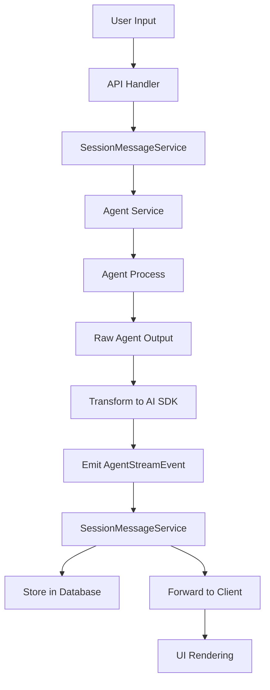

# Agent Message Architecture Design Document

## Overview

This document describes the architecture for handling agent messages in Cherry Studio, including how agent-specific messages are generated, transformed to AI SDK format, stored, and sent to the UI. The system is designed to be agent-agnostic, allowing multiple agent types (Claude Code, OpenAI, etc.) to integrate seamlessly.

## Core Design Principles

1. **Agent Agnosticism**: The core message handling system should work with any agent type without modification
2. **Data Preservation**: All raw agent data must be preserved alongside transformed UI-friendly formats
3. **Streaming First**: Support real-time streaming of agent responses to the UI
4. **Type Safety**: Strong TypeScript interfaces ensure consistency across the pipeline

## Architecture Components

### 1. Agent Service Layer

Each agent (e.g., ClaudeCodeService) implements the `AgentServiceInterface`:

```typescript
interface AgentServiceInterface {
  invoke(prompt: string, cwd: string, sessionId?: string, options?: any): AgentStream
}
```

#### Responsibilities:
- Spawn and manage agent-specific processes (e.g., Claude Code CLI)
- Parse agent-specific output formats (e.g., SDKMessage for Claude Code)
- Transform agent messages to AI SDK format
- Emit standardized `AgentStreamEvent` objects

### 2. Agent Stream Events

The standardized event interface that all agents emit:

```typescript
interface AgentStreamEvent {
  type: 'chunk' | 'error' | 'complete'
  chunk?: UIMessageChunk              // AI SDK format for UI
  rawAgentMessage?: any               // Agent-specific raw message
  error?: Error
  agentResult?: any                   // Complete agent-specific result
}
```

### 3. Session Message Service

The `SessionMessageService` acts as the orchestration layer:

#### Responsibilities:
- Manages session lifecycle and persistence
- Collects streaming chunks and raw agent messages
- Stores structured data in the database
- Forwards events to the API layer

### 4. Database Storage

Session messages are stored with complete structured data:

```typescript
interface SessionMessageContent {
  aiSDKChunks: UIMessageChunk[]      // UI-friendly format
  rawAgentMessages: any[]            // Original agent messages
  agentResult?: any                  // Complete agent result
  agentType: string                  // Agent identifier
}
```

## Data Flow



## Message Transformation Process

### Step 1: Raw Agent Message Generation

Each agent generates messages in its native format:

**Claude Code Example:**
```typescript
// SDKMessage from Claude Code CLI
{
  type: 'assistant',
  uuid: 'msg_123',
  session_id: 'session_456',
  message: {
    role: 'assistant',
    content: [
      { type: 'text', text: 'Hello, I can help...' },
      { type: 'tool_use', id: 'tool_1', name: 'read_file', input: {...} }
    ]
  }
}
```

### Step 2: Transformation to AI SDK Format

The agent service transforms native messages to AI SDK `UIMessageChunk`:

```typescript
// In ClaudeCodeService
const emitChunks = (sdkMessage: SDKMessage) => {
  // Transform to AI SDK format
  const chunks = transformSDKMessageToUIChunk(sdkMessage)

  for (const chunk of chunks) {
    stream.emit('data', {
      type: 'chunk',
      chunk,                        // AI SDK format
      rawAgentMessage: sdkMessage   // Preserve original
    })
  }
}
```

**Transformed AI SDK Chunk:**
```typescript
{
  type: 'text-delta',
  id: 'msg_123',
  delta: 'Hello, I can help...',
  providerMetadata: {
    claudeCode: {
      originalSDKMessage: {...},
      uuid: 'msg_123',
      session_id: 'session_456'
    }
  }
}
```

### Step 3: Session Message Processing

The SessionMessageService collects and processes events:

```typescript
// Collect streaming data
const streamedChunks: UIMessageChunk[] = []
const rawAgentMessages: any[] = []

claudeStream.on('data', async (event: AgentStreamEvent) => {
  switch (event.type) {
    case 'chunk':
      streamedChunks.push(event.chunk)
      if (event.rawAgentMessage) {
        rawAgentMessages.push(event.rawAgentMessage)
      }
      // Forward to client
      sessionStream.emit('data', { type: 'chunk', chunk: event.chunk })
      break

    case 'complete':
      // Store complete structured data
      const content = {
        aiSDKChunks: streamedChunks,
        rawAgentMessages: rawAgentMessages,
        agentResult: event.agentResult,
        agentType: event.agentResult?.agentType || 'unknown'
      }
      // Save to database...
      break
  }
})
```

### Step 4: Client Streaming

The API handler converts events to Server-Sent Events (SSE):

```typescript
// In API handler
messageStream.on('data', (event: any) => {
  switch (event.type) {
    case 'chunk':
      // Send AI SDK chunk as SSE
      res.write(`data: ${JSON.stringify(event.chunk)}\n\n`)
      break
    case 'complete':
      res.write('data: [DONE]\n\n')
      res.end()
      break
  }
})
```

## Adding New Agent Types

To add support for a new agent (e.g., OpenAI):

### 1. Create Agent Service

```typescript
class OpenAIService implements AgentServiceInterface {
  invokeStream(prompt: string, cwd: string, sessionId?: string, options?: any): AgentStream {
    const stream = new OpenAIStream()

    // Call OpenAI API
    const openaiResponse = await openai.chat.completions.create({
      messages: [{ role: 'user', content: prompt }],
      stream: true
    })

    // Transform OpenAI format to AI SDK
    for await (const chunk of openaiResponse) {
      const aiSDKChunk = transformOpenAIToAISDK(chunk)
      stream.emit('data', {
        type: 'chunk',
        chunk: aiSDKChunk,
        rawAgentMessage: chunk  // Preserve OpenAI format
      })
    }

    return stream
  }
}
```

### 2. Create Transform Function

```typescript
function transformOpenAIToAISDK(openaiChunk: OpenAIChunk): UIMessageChunk {
  return {
    type: 'text-delta',
    id: openaiChunk.id,
    delta: openaiChunk.choices[0].delta.content,
    providerMetadata: {
      openai: {
        original: openaiChunk,
        model: openaiChunk.model
      }
    }
  }
}
```

### 3. Register Agent Type

Update the agent type enum and factory:

```typescript
export type AgentType = 'claude-code' | 'openai' | 'anthropic-api'

function createAgentService(type: AgentType): AgentServiceInterface {
  switch (type) {
    case 'claude-code':
      return new ClaudeCodeService()
    case 'openai':
      return new OpenAIService()
    // ...
  }
}
```

## Benefits of This Architecture

1. **Extensibility**: Easy to add new agent types without modifying core logic
2. **Data Integrity**: Raw agent data is never lost during transformation
3. **Debugging**: Complete message history available for troubleshooting
4. **Performance**: Streaming support for real-time responses
5. **Type Safety**: Strong interfaces prevent runtime errors
6. **UI Consistency**: All agents provide data in standard AI SDK format

## Key Interfaces Reference

### AgentStreamEvent
```typescript
interface AgentStreamEvent {
  type: 'chunk' | 'error' | 'complete'
  chunk?: UIMessageChunk
  rawAgentMessage?: any
  error?: Error
  agentResult?: any
}
```

### SessionMessageEntity
```typescript
interface SessionMessageEntity {
  id: number
  session_id: string
  parent_id?: number
  role: 'user' | 'assistant' | 'system' | 'tool'
  type: string
  content: string | SessionMessageContent
  metadata?: Record<string, any>
  created_at: string
  updated_at: string
}
```

### SessionMessageContent
```typescript
interface SessionMessageContent {
  aiSDKChunks: UIMessageChunk[]
  rawAgentMessages: any[]
  agentResult?: any
  agentType: string
}
```

## Testing Strategy

### Unit Tests
- Test each transform function independently
- Verify event emission sequences
- Validate data structure preservation

### Integration Tests
- Test complete flow from input to database
- Verify streaming behavior
- Test error handling and recovery

### Agent-Specific Tests
- Validate agent-specific transformations
- Test edge cases for each agent type
- Verify metadata preservation

## Future Enhancements

1. **Message Replay**: Ability to replay sessions from stored raw messages
2. **Format Migration**: Tools to migrate between agent formats
3. **Analytics**: Aggregate metrics from raw agent data
4. **Caching**: Cache transformed chunks for performance
5. **Compression**: Compress raw messages for storage efficiency

## Conclusion

This architecture provides a robust, extensible foundation for handling messages from multiple AI agents while maintaining data integrity and providing a consistent interface for the UI. The separation of concerns between agent-specific logic and core message handling ensures the system can evolve to support new agents and features without breaking existing functionality.
