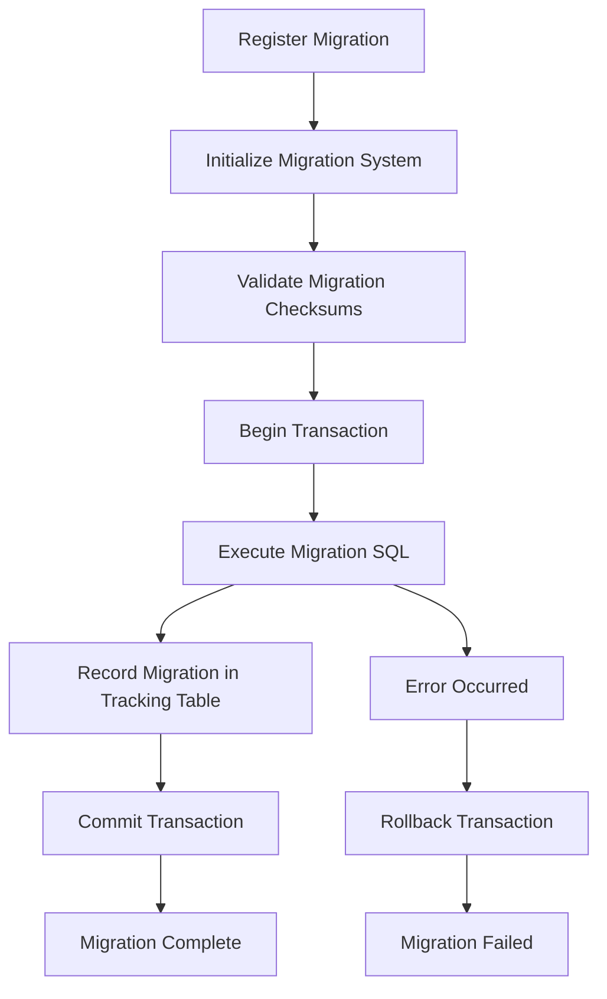

# Agents Database Module

A production-ready database management system for Cherry Studio's autonomous agent management system. This module provides a migration-only approach to database schema management with comprehensive transaction support and rollback capabilities.

## Overview

The Agents Database Module handles persistent storage for:
- **Agents**: Autonomous AI agents with configurable models, tools, and permissions
- **Sessions**: Agent execution sessions with status tracking and configuration overrides
- **Session Logs**: Hierarchical message and action logs for debugging and audit trails

Built on [libsql/client](https://github.com/tursodatabase/libsql-js), this system is designed for an Electron application environment with full SQLite compatibility.

## Architecture

### Migration-Only Approach

This database module follows a **migration-only architecture**:

- **Single Source of Truth**: All table and index definitions live exclusively in migration files
- **No Separate Schema Files**: Table structures are maintained in migration files, not separate schema definitions
- **Version Control**: Every schema change is tracked through versioned migrations with checksums
- **Rollback Support**: All migrations include rollback instructions for safe schema reversions

### Key Benefits

- ✅ **Audit Trail**: Complete history of all database schema changes
- ✅ **Environment Consistency**: Same schema across development, testing, and production
- ✅ **Safe Deployments**: Transaction-wrapped migrations with automatic rollback on failure
- ✅ **Integrity Validation**: Checksum verification prevents unauthorized migration modifications
- ✅ **Collaborative Development**: No schema conflicts between team members

## Directory Structure

```
database/
├── index.ts                    # Main export file with centralized access
├── migrator.ts                # Core migration engine with transaction support
├── migrations/                # Migration files and registry
│   ├── index.ts               # Migration registry and utility functions  
│   ├── types.ts               # TypeScript interfaces for migration system
│   ├── 001_initial_schema.ts  # Initial agents table and indexes
│   └── 002_add_session_tables.ts # Sessions and session_logs tables
├── queries/                   # SQL queries organized by entity
│   ├── index.ts              # Export all query modules
│   ├── agent.queries.ts      # Agent CRUD operations
│   ├── session.queries.ts    # Session management queries
│   └── sessionLog.queries.ts # Session log operations
└── schema/                   # Migration tracking schema
    ├── index.ts              # Export schema utilities
    └── migrations.ts         # Migration tracking table definitions
```

### File Responsibilities

| Directory | Purpose | Key Files |
|-----------|---------|-----------|
| `/` | Main entry point and core migration engine | `index.ts`, `migrator.ts` |
| `migrations/` | Version-controlled schema changes | `001_*.ts`, `002_*.ts`, etc. |
| `queries/` | Pre-built SQL queries by entity | `*.queries.ts` |
| `schema/` | Migration system infrastructure | `migrations.ts` |

## Migration System

### Migration Lifecycle



### Migration Structure

Each migration follows a standardized structure:

```typescript
// Example: migrations/003_add_new_feature.ts
import type { Migration } from './types'

export const migration_003_add_new_feature: Migration = {
  id: '003',
  description: 'Add new feature table with indexes',
  createdAt: new Date('2024-12-10T10:00:00.000Z'),
  up: [
    // Forward migration SQL statements
    `CREATE TABLE IF NOT EXISTS feature_table (
      id TEXT PRIMARY KEY,
      name TEXT NOT NULL,
      created_at DATETIME DEFAULT CURRENT_TIMESTAMP
    )`,
    'CREATE INDEX IF NOT EXISTS idx_feature_name ON feature_table(name)'
  ],
  down: [
    // Rollback SQL statements (optional but recommended)
    'DROP INDEX IF EXISTS idx_feature_name',
    'DROP TABLE IF EXISTS feature_table'
  ]
}
```

### Creating New Migrations

1. **Create Migration File**: Follow naming convention `XXX_descriptive_name.ts`
2. **Define Migration Object**: Include id, description, createdAt, up, and down
3. **Register in Index**: Add to `migrations/index.ts` exports array
4. **Test Migration**: Run in development environment before deploying

```typescript
// Step 1: Create file migrations/003_add_permissions.ts
export const migration_003_add_permissions: Migration = {
  id: '003',
  description: 'Add permissions table for fine-grained access control',
  createdAt: new Date(),
  up: [
    `CREATE TABLE permissions (
      id TEXT PRIMARY KEY,
      agent_id TEXT NOT NULL,
      resource TEXT NOT NULL,
      action TEXT NOT NULL,
      granted BOOLEAN DEFAULT FALSE,
      FOREIGN KEY (agent_id) REFERENCES agents(id) ON DELETE CASCADE
    )`
  ],
  down: ['DROP TABLE IF EXISTS permissions']
}

// Step 2: Register in migrations/index.ts
export const migrations: Migration[] = [
  migration_001_initial_schema,
  migration_002_add_session_tables,
  migration_003_add_permissions  // Add here
]
```

### Migration Best Practices

#### ✅ Do's

- **Use transactions**: Always run migrations with `useTransaction: true` (default)
- **Include rollback**: Provide `down` migrations for safe reversions
- **Sequential IDs**: Use sequential migration IDs (001, 002, 003...)
- **Descriptive names**: Use clear, descriptive migration names
- **Test first**: Test migrations in development before production
- **Small changes**: Keep migrations focused on single logical changes

#### ❌ Don'ts

- **Don't modify applied migrations**: Never change a migration that's been applied
- **Don't skip IDs**: Don't create gaps in migration sequence
- **Don't mix concerns**: Avoid combining unrelated changes in single migration
- **Don't omit indexes**: Create indexes for foreign keys and query columns
- **Don't forget constraints**: Include necessary foreign key constraints

## Query Organization

Queries are organized by entity with consistent naming patterns:

### Agent Queries (`AgentQueries`)

```typescript
// Basic CRUD operations
AgentQueries.insert    // Create new agent
AgentQueries.update    // Update existing agent
AgentQueries.getById   // Get agent by ID
AgentQueries.list      // List all agents
AgentQueries.delete    // Delete agent
AgentQueries.count     // Count total agents
AgentQueries.checkExists // Check if agent exists
```

### Session Queries (`SessionQueries`)

```typescript
// Session management
SessionQueries.insert              // Create new session
SessionQueries.update              // Update session
SessionQueries.updateStatus        // Update just status
SessionQueries.getById             // Get session by ID
SessionQueries.list                // List all sessions
SessionQueries.listWithLimit       // Paginated session list
SessionQueries.getByStatus         // Filter by status
SessionQueries.getSessionWithAgent // Join with agent data
SessionQueries.getByExternalSessionId // Find by external ID
```

### Session Log Queries (`SessionLogQueries`)

```typescript
// Log operations
SessionLogQueries.insert                    // Add log entry
SessionLogQueries.getBySessionId            // Get all logs for session
SessionLogQueries.getBySessionIdWithPagination // Paginated logs
SessionLogQueries.getLatestBySessionId      // Most recent logs
SessionLogQueries.update                    // Update log entry
SessionLogQueries.deleteBySessionId         // Clear session logs
SessionLogQueries.countBySessionId          // Count session logs
```

## Development Workflow

### Adding New Entity

Follow these steps to add a new database entity:

1. **Create Migration**:
   ```bash
   # Create new migration file
   touch migrations/004_add_workflows.ts
   ```

2. **Define Migration**:
   ```typescript
   export const migration_004_add_workflows: Migration = {
     id: '004', 
     description: 'Add workflows table for agent automation',
     createdAt: new Date(),
     up: [
       `CREATE TABLE workflows (
         id TEXT PRIMARY KEY,
         name TEXT NOT NULL,
         agent_id TEXT NOT NULL,
         steps TEXT NOT NULL, -- JSON array of workflow steps
         status TEXT DEFAULT 'draft',
         created_at DATETIME DEFAULT CURRENT_TIMESTAMP,
         FOREIGN KEY (agent_id) REFERENCES agents(id) ON DELETE CASCADE
       )`,
       'CREATE INDEX idx_workflows_agent_id ON workflows(agent_id)',
       'CREATE INDEX idx_workflows_status ON workflows(status)'
     ],
     down: [
       'DROP INDEX IF EXISTS idx_workflows_status',
       'DROP INDEX IF EXISTS idx_workflows_agent_id', 
       'DROP TABLE IF EXISTS workflows'
     ]
   }
   ```

3. **Register Migration**:
   ```typescript
   // migrations/index.ts
   export const migrations = [
     // ... existing migrations
     migration_004_add_workflows
   ]
   ```

4. **Create Query Module**:
   ```typescript
   // queries/workflow.queries.ts
   export const WorkflowQueries = {
     insert: 'INSERT INTO workflows (id, name, agent_id, steps, status, created_at) VALUES (?, ?, ?, ?, ?, ?)',
     getById: 'SELECT * FROM workflows WHERE id = ?',
     getByAgentId: 'SELECT * FROM workflows WHERE agent_id = ?',
     // ... other queries
   }
   ```

5. **Export Query Module**:
   ```typescript
   // queries/index.ts
   export { WorkflowQueries } from './workflow.queries'
   ```

6. **Update Main Export**:
   ```typescript
   // index.ts
   export * as WorkflowQueries from './queries/workflow.queries'
   ```

### Running Migrations

```typescript
import { Migrator, migrations } from './database'
import { createClient } from '@libsql/client'

// Initialize database connection
const db = createClient({
  url: 'file:agents.db'
})

// Create migrator instance
const migrator = new Migrator(db)

// Register all migrations
migrator.addMigrations(migrations)

// Initialize migration system (creates tracking table)
await migrator.initialize()

// Run all pending migrations
const results = await migrator.migrate()

// Check migration status
const summary = await migrator.getMigrationSummary()
console.log(`Applied ${summary.appliedMigrations}/${summary.totalMigrations} migrations`)
```

## API Reference

### Core Classes

#### `Migrator`

Main migration management class with transaction support.

```typescript
class Migrator {
  constructor(database: Client)
  
  // Migration management
  addMigration(migration: Migration): void
  addMigrations(migrations: Migration[]): void
  
  // System lifecycle
  initialize(): Promise<void>
  migrate(options?: MigrationOptions): Promise<MigrationResult[]>
  rollbackLast(): Promise<MigrationResult | null>
  
  // Status and validation
  getMigrationSummary(): Promise<MigrationSummary>
  validateMigrations(): Promise<ValidationResult>
}
```

#### Migration Options

```typescript
interface MigrationOptions {
  useTransaction?: boolean      // Run in transaction (default: true)
  validateChecksums?: boolean   // Validate migration checksums (default: true)  
  limit?: number               // Max migrations to run (default: unlimited)
  dryRun?: boolean             // Preview mode (default: false)
}
```

#### Migration Types

```typescript
interface Migration {
  id: string                   // Unique migration identifier
  description: string          // Human-readable description
  up: string[]                // Forward migration SQL statements
  down?: string[]             // Rollback SQL statements (optional)
  createdAt: Date             // Migration creation timestamp
}

interface MigrationResult {
  migration: Migration         // Migration that was executed
  success: boolean            // Execution success status
  error?: string              // Error message if failed
  executedAt: Date            // Execution timestamp
  executionTime: number       // Execution duration in milliseconds
}
```

### Database Schema

#### Agents Table

```sql
CREATE TABLE agents (
  id TEXT PRIMARY KEY,
  type TEXT NOT NULL DEFAULT 'custom',        -- 'claudeCode', 'codex', 'custom'
  name TEXT NOT NULL,
  description TEXT,
  avatar TEXT,
  instructions TEXT,
  model TEXT NOT NULL,                        -- Main model ID (required)
  plan_model TEXT,                           -- Optional plan/thinking model ID
  small_model TEXT,                          -- Optional small/fast model ID
  built_in_tools TEXT,                       -- JSON array of built-in tool IDs
  mcps TEXT,                                 -- JSON array of MCP tool IDs
  knowledges TEXT,                           -- JSON array of knowledge base IDs
  configuration TEXT,                        -- JSON extensible settings
  accessible_paths TEXT,                     -- JSON array of directory paths
  permission_mode TEXT DEFAULT 'readOnly',   -- 'readOnly', 'acceptEdits', 'bypassPermissions'
  max_steps INTEGER DEFAULT 10,              -- Maximum execution steps
  created_at DATETIME DEFAULT CURRENT_TIMESTAMP,
  updated_at DATETIME DEFAULT CURRENT_TIMESTAMP
)
```

#### Sessions Table

```sql
CREATE TABLE sessions (
  id TEXT PRIMARY KEY,
  name TEXT,
  main_agent_id TEXT NOT NULL,              -- Primary agent for session
  sub_agent_ids TEXT,                       -- JSON array of sub-agent IDs
  user_goal TEXT,                           -- Initial user objective
  status TEXT NOT NULL DEFAULT 'idle',      -- 'idle', 'running', 'completed', 'failed', 'stopped'
  external_session_id TEXT,                 -- External tracking ID
  -- Configuration overrides (inherit from agent if NULL)
  model TEXT,
  plan_model TEXT,
  small_model TEXT,
  built_in_tools TEXT,
  mcps TEXT,
  knowledges TEXT,
  configuration TEXT,
  accessible_paths TEXT,
  permission_mode TEXT DEFAULT 'readOnly',
  max_steps INTEGER DEFAULT 10,
  created_at DATETIME DEFAULT CURRENT_TIMESTAMP,
  updated_at DATETIME DEFAULT CURRENT_TIMESTAMP,
  FOREIGN KEY (main_agent_id) REFERENCES agents(id) ON DELETE CASCADE
)
```

#### Session Logs Table  

```sql
CREATE TABLE session_logs (
  id INTEGER PRIMARY KEY AUTOINCREMENT,
  session_id TEXT NOT NULL,
  parent_id INTEGER,                        -- For hierarchical log structure
  role TEXT NOT NULL,                       -- 'user', 'agent', 'system', 'tool'
  type TEXT NOT NULL,                       -- 'message', 'thought', 'action', 'observation'
  content TEXT NOT NULL,                    -- JSON structured data
  metadata TEXT,                            -- JSON metadata (optional)
  created_at DATETIME DEFAULT CURRENT_TIMESTAMP,
  updated_at DATETIME DEFAULT CURRENT_TIMESTAMP,
  FOREIGN KEY (session_id) REFERENCES sessions(id) ON DELETE CASCADE,
  FOREIGN KEY (parent_id) REFERENCES session_logs(id)
)
```

## Examples

### Basic Migration Setup

```typescript
import { Migrator, migrations, AgentQueries } from './database'
import { createClient } from '@libsql/client'

async function setupDatabase() {
  // Create database connection
  const db = createClient({ url: 'file:agents.db' })
  
  // Initialize migration system
  const migrator = new Migrator(db)
  migrator.addMigrations(migrations)
  await migrator.initialize()
  
  // Run pending migrations
  const results = await migrator.migrate()
  console.log(`Migrations complete: ${results.length} applied`)
  
  return db
}
```

### Creating an Agent

```typescript
import { AgentQueries } from './database'

async function createAgent(db: Client) {
  const agent = {
    id: crypto.randomUUID(),
    type: 'custom',
    name: 'Code Review Assistant', 
    description: 'Helps review code for best practices',
    avatar: null,
    instructions: 'Review code for security, performance, and maintainability',
    model: 'claude-3-sonnet-20241022',
    plan_model: null,
    small_model: 'claude-3-haiku-20241022',
    built_in_tools: JSON.stringify(['file_search', 'code_analysis']),
    mcps: JSON.stringify([]),
    knowledges: JSON.stringify(['coding-standards']),
    configuration: JSON.stringify({ temperature: 0.1, top_p: 0.9 }),
    accessible_paths: JSON.stringify(['/src', '/tests']),
    permission_mode: 'readOnly',
    max_steps: 20,
    created_at: new Date().toISOString(),
    updated_at: new Date().toISOString()
  }
  
  await db.execute({
    sql: AgentQueries.insert,
    args: Object.values(agent)
  })
  
  return agent.id
}
```

### Managing Sessions

```typescript
import { SessionQueries, SessionLogQueries } from './database'

async function createSession(db: Client, agentId: string) {
  const sessionId = crypto.randomUUID()
  
  // Create session
  await db.execute({
    sql: SessionQueries.insert,
    args: [
      sessionId,
      'Code Review Session',
      agentId,
      null, // sub_agent_ids
      'Review the authentication module for security issues',
      'running',
      null, // external_session_id
      null, null, null, null, null, null, null, null, null, null, // config overrides
      new Date().toISOString(),
      new Date().toISOString()
    ]
  })
  
  // Add initial log entry
  await db.execute({
    sql: SessionLogQueries.insert,
    args: [
      sessionId,
      null, // parent_id
      'user',
      'message',
      JSON.stringify({
        text: 'Please review the authentication module',
        files: ['/src/auth/login.ts', '/src/auth/middleware.ts']
      }),
      null, // metadata
      new Date().toISOString(),
      new Date().toISOString()
    ]
  })
  
  return sessionId
}
```

### Query with Joins

```typescript
async function getSessionWithAgent(db: Client, sessionId: string) {
  const result = await db.execute({
    sql: SessionQueries.getSessionWithAgent,
    args: [sessionId]
  })
  
  if (result.rows.length === 0) {
    throw new Error('Session not found')
  }
  
  const row = result.rows[0]
  return {
    // Session data
    session: {
      id: row.id,
      name: row.name,
      status: row.status,
      user_goal: row.user_goal,
      created_at: row.created_at
    },
    // Agent data
    agent: {
      id: row.main_agent_id,
      name: row.agent_name,
      description: row.agent_description,
      avatar: row.agent_avatar
    },
    // Effective configuration (session overrides + agent defaults)
    config: {
      model: row.effective_model,
      plan_model: row.effective_plan_model,
      permission_mode: row.effective_permission_mode,
      max_steps: row.effective_max_steps
    }
  }
}
```

## Best Practices

### Database Design

1. **Use Transactions**: Always wrap related operations in transactions
2. **Foreign Key Constraints**: Define relationships with proper CASCADE rules
3. **Indexes**: Create indexes for foreign keys and frequently queried columns  
4. **JSON Columns**: Use JSON for flexible, extensible data structures
5. **Timestamps**: Include created_at and updated_at for audit trails

### Migration Management

1. **Sequential Numbering**: Use zero-padded sequential IDs (001, 002, 003...)
2. **Descriptive Names**: Use clear, descriptive migration descriptions
3. **Atomic Changes**: Keep migrations focused on single logical changes
4. **Rollback Support**: Always provide down migrations for safe reversions
5. **Test Thoroughly**: Test migrations in development before production

### Query Organization

1. **Entity Separation**: Group queries by entity for maintainability
2. **Consistent Naming**: Use consistent naming patterns across all queries
3. **Parameterized Queries**: Always use parameterized queries to prevent SQL injection
4. **Efficient Queries**: Use appropriate indexes and avoid N+1 query problems
5. **Documentation**: Comment complex queries and business logic

### Error Handling  

1. **Transaction Rollback**: Use transactions with proper rollback on errors
2. **Validation**: Validate input data before database operations
3. **Logging**: Log all database errors with context for debugging
4. **Graceful Degradation**: Handle database unavailability gracefully
5. **Retry Logic**: Implement retry logic for transient failures

## Troubleshooting

### Common Issues

#### Migration Fails with "Table already exists"

**Problem**: Migration tries to create a table that already exists.

**Solution**: Use `IF NOT EXISTS` in all CREATE statements:
```sql
CREATE TABLE IF NOT EXISTS my_table (...);
CREATE INDEX IF NOT EXISTS idx_name ON my_table(column);
```

#### Checksum Mismatch Error

**Problem**: Migration checksum doesn't match recorded checksum.

**Cause**: Migration file was modified after being applied.

**Solutions**:
1. **Never modify applied migrations** - create a new migration instead
2. If in development, reset database and re-run all migrations
3. For production, investigate what changed and create corrective migration

#### Foreign Key Constraint Error

**Problem**: Cannot insert/update due to foreign key constraint violation.

**Solutions**:
1. Ensure referenced record exists before creating relationship
2. Check foreign key column names and types match exactly
3. Use transactions to maintain referential integrity

#### Migration Stuck in Transaction

**Problem**: Migration appears to hang during execution.

**Causes**: 
- Long-running ALTER TABLE operations
- Lock contention from other database connections
- Complex migration with multiple DDL operations

**Solutions**:
1. Break large migrations into smaller chunks
2. Ensure no other processes are using database during migration
3. Use migration limit option to apply migrations incrementally

#### Database Lock Error

**Problem**: `SQLITE_BUSY` or `database is locked` errors.

**Solutions**:
1. Ensure only one process accesses database at a time
2. Close all database connections properly
3. Use shorter transactions to reduce lock duration
4. Implement retry logic with exponential backoff

### Debugging Migration Issues

#### Enable Detailed Logging

```typescript
const migrator = new Migrator(db)

// Add debug logging
migrator.addMigrations(migrations)

// Enable verbose migration logging
const results = await migrator.migrate({
  dryRun: true  // Preview migrations without applying
})

console.log('Migration preview:', results)
```

#### Validate Migration State

```typescript
// Check current migration status
const summary = await migrator.getMigrationSummary()
console.log('Migration Status:', {
  current: summary.currentVersion,
  applied: summary.appliedMigrations,
  pending: summary.pendingMigrations,
  pendingIds: summary.pendingMigrationIds
})

// Validate migration integrity
const validation = await migrator.validateMigrations()
if (!validation.isValid) {
  console.error('Migration validation failed:', validation.errors)
}

if (validation.warnings.length > 0) {
  console.warn('Migration warnings:', validation.warnings)
}
```

#### Manual Migration Recovery

```typescript
// If you need to manually mark a migration as applied
// (Use with extreme caution!)
await db.execute({
  sql: `INSERT INTO migrations (id, description, applied_at, execution_time, checksum) 
        VALUES (?, ?, ?, ?, ?)`,
  args: ['001', 'Manual recovery', new Date().toISOString(), 0, 'manual']
})
```

### Performance Optimization

#### Index Usage

Monitor query performance and add indexes for frequently used columns:

```sql
-- Add indexes for common query patterns
CREATE INDEX idx_sessions_status_created ON sessions(status, created_at);
CREATE INDEX idx_session_logs_session_type ON session_logs(session_id, type);
CREATE INDEX idx_agents_type_name ON agents(type, name);
```

#### Query Optimization

Use EXPLAIN QUERY PLAN to analyze query performance:

```typescript
// Analyze query execution plan
const result = await db.execute('EXPLAIN QUERY PLAN ' + SessionQueries.getByStatus)
console.log('Query plan:', result.rows)
```

#### Connection Management

Properly manage database connections:

```typescript
// Use connection pooling for multiple concurrent operations
const db = createClient({
  url: 'file:agents.db',
  syncUrl: process.env.TURSO_SYNC_URL, // For Turso sync
  authToken: process.env.TURSO_AUTH_TOKEN
})

// Always close connections when done
process.on('exit', () => {
  db.close()
})
```

---

## Support

For questions about the database system:

1. **Check Migration Status**: Use `migrator.getMigrationSummary()` and `migrator.validateMigrations()`
2. **Review Logs**: Check application logs for detailed error messages
3. **Examine Schema**: Use SQLite tools to inspect current database schema
4. **Test in Development**: Always test schema changes in development environment first

This database system is designed to be robust and production-ready. Following the migration-only approach and best practices outlined in this guide will ensure reliable, maintainable database operations for your agent management system.